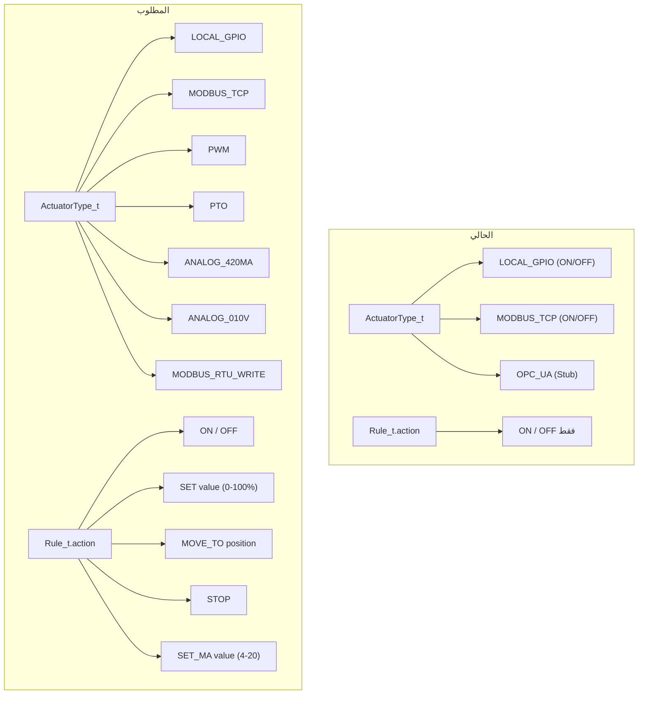

# Kontrx Universal Controller — تحليل شامل وخطة تنفيذ

## الملخص التنفيذي

هذا التحليل مبني على فحص كامل للكود الحالي (MCAL, HAL, APP) والـ Pin Map الفعلي للبوردة STM32F407VET6.
الهدف: تحويل Kontrx من جهاز تحكم بـ Relays فقط (ON/OFF) إلى **Universal Controller** يدعم PTO, PWM, Analog I/O, وبروتوكولات اتصال متعددة — كل ده بشكل **Dynamic** زي النظام الحالي.

---

> [!CAUTION]
> ### تصحيح مهم عن الـ Prompt الأصلي
> الـ Prompt الأصلي ذكر إن **SPI1 (PA4, PA5, PA6) فارغ** — وده **غلط**.
> الحقيقة من الكود:
> - **SPI1** مستخدم فعلاً لشريحة **W25Q16 Flash** على الأطراف **PB0 (CS), PB3 (SCK), PB4 (MISO), PB5 (MOSI)**
> - **PA4** مستخدم كـ **Relay Output** (Relay 9)
> - **PA6** مستخدم كـ **Status LED**
> - الحل: استخدام **SPI3** (PC10, PC11, PC12) اللي فاضي تماماً للـ DAC الخارجي

---

## الجزء الأول: خريطة الهاردوير الحالية

### الأطراف المستخدمة حالياً (27 طرف)

| الوظيفة | الأطراف | العدد |
|---|---|---|
| **Relays (GPIO Output)** | PE2, PE4, PE6, PC0, PC2, PA0, PA1, PA2, PA4, PC4, PD8 | 11 |
| **Status LED** | PA6 | 1 |
| **SPI1 → W25Q16 Flash** | PB0 (CS), PB3 (SCK), PB4 (MISO), PB5 (MOSI) | 4 |
| **SPI2 → W5500 Ethernet** | PB12 (CS), PB13 (SCK), PB14 (MISO), PB15 (MOSI) | 4 |
| **USART1 → Alt Debug** | PA9 (TX), PA10 (RX) | 2 |
| **USART3 → RS485 Modbus** | PB10 (TX), PB11 (RX), PD2 (RE#), PD3 (DE) | 4 |
| **USART6 → Debug Console** | PC6 (TX), PC7 (RX) | 2 |
| **SWD Debug** | PA13 (SWDIO), PA14 (SWCLK) | 2 |
| **RTC Crystal** | PC14 (OSC32_IN), PC15 (OSC32_OUT) | 2 |
| **HSE Crystal** | PH0 (OSC_IN), PH1 (OSC_OUT) | 2 |

### الأطراف الحرة المتاحة (47 طرف)

```
Port A (7):  PA3, PA5, PA7, PA8, PA11, PA12, PA15
Port B (5):  PB1, PB6, PB7, PB8, PB9
Port C (9):  PC1, PC3, PC5, PC8, PC9, PC10, PC11, PC12, PC13
Port D (13): PD0, PD1, PD4, PD5, PD6, PD7, PD9, PD10, PD11, PD12, PD13, PD14, PD15
Port E (13): PE0, PE1, PE3, PE5, PE7, PE8, PE9, PE10, PE11, PE12, PE13, PE14, PE15
```

---

## الجزء الثاني: تحليل كل Protocol / Interface

---

### 1. PTO — Pulse Train Output (التحكم في Stepper / Servo Motors)

#### المبدأ
كل قناة PTO تحتاج:
- **PUL (Pulse):** طرف Timer في وضع Output Compare/PWM لتوليد نبضات بتردد متغير (التردد = السرعة)
- **DIR (Direction):** طرف GPIO عادي لتحديد اتجاه الدوران
- **EN (Enable):** طرف GPIO اختياري لتفعيل/تعطيل الـ Driver
- **LMT (Limit Switch):** طرف GPIO Input مع EXTI Interrupt لإيقاف فوري عند الوصول للحد

#### الأطراف المقترحة — TIM1 (Advanced Control Timer)

TIM1 هو الاختيار الأمثل للـ PTO لأنه:
- Advanced Timer مصمم أساساً للـ Motor Control
- يدعم Center-Aligned Mode و Dead-Time Insertion
- يدعم Complementary Outputs (PE8, PE10, PE12 كـ CH1N, CH2N, CH3N)
- 4 قنوات مستقلة

| القناة | PUL (Timer) | DIR (GPIO) | LMT (EXTI Input) |
|---|---|---|---|
| **PTO1** | PE9 (TIM1_CH1) | PE8 (GPIO Out) | PE0 (GPIO In + EXTI0) |
| **PTO2** | PE11 (TIM1_CH2) | PE10 (GPIO Out) | PE1 (GPIO In + EXTI1) |
| **PTO3** | PE13 (TIM1_CH3) | PE12 (GPIO Out) | PE3 (GPIO In + EXTI3) |
| **PTO4** | PE14 (TIM1_CH4) | PE15 (GPIO Out) | PE7 (GPIO In + EXTI) |

**إجمالي الأطراف:** 12 طرف (4 PUL + 4 DIR + 4 LMT)

#### السعة القصوى: **4 قنوات PTO**

> [!IMPORTANT]
> ### مشكلة التردد المشترك في TIM1
> كل قنوات TIM1 تشترك في نفس الـ **ARR (Auto-Reload Register)** مما يعني نفس الـ Base Frequency.
> **الحل:** استخدام **Output Compare Mode + ISR** بدلاً من PWM Mode المباشر.
> في كل Interrupt، الـ ISR يعدّل قيمة الـ Compare Register للقناة المحددة، مما يتيح تردد مستقل لكل قناة.
> هذا يستهلك وقت CPU أكثر لكنه يوفر استقلالية كاملة.
>
> **البديل:** تخصيص Timer مستقل لكل PTO (TIM1_CH1, TIM4_CH1, TIM3_CH1, TIM9_CH1) — لكن هذا يأكل من مخزون الـ PWM.

#### التحكم من الـ Dashboard

```
┌──────────────────────────────────────────────┐
│  PTO Channel 1 — Stepper Motor X-Axis        │
│  ┌────────────────────────────────────┐       │
│  │  Position: ████████░░░░  1250/5000 │       │
│  └────────────────────────────────────┘       │
│  Speed: [====●===========] 800 pps            │
│  Direction: [◄ CCW] ● [CW ►]                 │
│  ⚠ LMT+ Active — Forward motion blocked      │
│  [▶ START]  [⏸ PAUSE]  [⏹ STOP]  [🏠 HOME]  │
└──────────────────────────────────────────────┘
```

- **Slider للسرعة:** يتحكم في تردد النبضات (pulses per second)
- **Position Bar:** يعرض الموضع الحالي بالنسبة للمدى الكامل
- **LMT Indicator:** لما الـ Limit Switch يتفعّل، الـ Slider **يتجمّد** في الاتجاه المحظور
- **Buttons:** Start / Pause / Stop / Home (العودة لنقطة الصفر)

#### التكامل مع الـ Rules Engine

```json
{
  "input_id": "temperature_sensor_1",
  "operator": ">",
  "threshold": 45.0,
  "output_id": "PTO1",
  "action": "STOP"
}
```

```json
{
  "input_id": "position_sensor_1",
  "operator": "<",
  "threshold": 100.0,
  "output_id": "PTO1",
  "action": "MOVE_TO",
  "value": 5000,
  "speed": 1000
}
```

---

### 2. PWM — Pulse Width Modulation (التحكم في VFDs / الإضاءة / المراوح)

#### المبدأ
إشارة PWM بتردد ثابت و Duty Cycle متغير (0-100%) للتحكم التناسبي المباشر.

#### الأطراف المقترحة

**المجموعة الأساسية — TIM4 (4 قنوات متجانسة):**

| القناة | الطرف | Timer Channel |
|---|---|---|
| **PWM1** | PD12 | TIM4_CH1 |
| **PWM2** | PD13 | TIM4_CH2 |
| **PWM3** | PD14 | TIM4_CH3 |
| **PWM4** | PD15 | TIM4_CH4 |

**المجموعة الإضافية — Timers متفرقة:**

| القناة | الطرف | Timer Channel | ملاحظات |
|---|---|---|---|
| **PWM5** | PE5 | TIM9_CH1 | تردد مستقل عن TIM4 |
| **PWM6** | PB1 | TIM3_CH4 | تردد مستقل |
| **PWM7** | PA3 | TIM2_CH4 | تردد مستقل |
| **PWM8** | PA7 | TIM14_CH1 | تردد مستقل |
| **PWM9** | PB8 | TIM10_CH1 | تردد مستقل (يتعارض مع I2C1 SCL!) |

#### السعة القصوى: **8–9 قنوات PWM** (حسب تخصيص I2C)

> [!NOTE]
> قنوات TIM4 الأربعة تشترك في نفس التردد لكن بـ Duty Cycle مختلف — وده مناسب تماماً للـ PWM لأن عادةً كل التطبيقات تستخدم نفس تردد الـ PWM (مثلاً 1 kHz أو 20 kHz).
> أما القنوات على Timers مختلفة (TIM9, TIM3, TIM2, TIM14) فكل واحدة ليها تردد مستقل تماماً.

#### التحكم من الـ Dashboard

```
┌──────────────────────────────────────────────┐
│  PWM Channel 3 — Exhaust Fan VFD             │
│  Duty Cycle: [==========●====] 67%           │
│  Frequency:  1000 Hz                         │
│  Output:     Active ●                        │
│  ────────────────────────────────────────     │
│  Min: 0%  ├──────────────────────┤  Max: 100%│
└──────────────────────────────────────────────┘
```

- **Slider:** يتحكم في الـ Duty Cycle من 0% إلى 100%
- **Frequency Input:** قابل للتعديل حسب التطبيق
- القيمة بتتحدث على الـ Controller عبر API

---

### 3. Analog Output — 4-20mA / 0-20mA (عبر SPI DAC)

#### المبدأ
استخدام شريحة **DAC خارجية** (مثل MCP4922 Dual 12-bit أو AD5624 Quad 12-bit) متصلة بـ **SPI3** لتحويل القيم الرقمية إلى تيار 4-20mA عبر دائرة تحويل (Voltage-to-Current Converter مثل XTR111 أو دائرة OpAmp).

#### الأطراف المقترحة — SPI3 (حر تماماً)

**ناقل SPI3:**

| الوظيفة | الطرف |
|---|---|
| **SPI3_SCK** | PC10 |
| **SPI3_MISO** | PC11 |
| **SPI3_MOSI** | PC12 |

**أطراف Chip Select:**

| CS | الطرف | الشريحة | القنوات |
|---|---|---|---|
| **CS1** | PC1 | DAC Chip 1 (Dual MCP4922) | 2 × 4-20mA |
| **CS2** | PC3 | DAC Chip 2 (Dual MCP4922) | 2 × 4-20mA |
| **CS3** | PC5 | DAC Chip 3 (Dual MCP4922) | 2 × 4-20mA |
| **CS4** | PC13 | DAC Chip 4 (Dual MCP4922) | 2 × 4-20mA |

**إجمالي الأطراف:** 7 (3 SPI + 4 CS)

#### السعة القصوى: **8 قنوات 4-20mA** (باستخدام 4 × MCP4922 Dual DAC)

> [!WARNING]
> ### تعارض SPI3 مع UART4 / UART5
> أطراف SPI3 (PC10, PC11, PC12) هي نفس أطراف UART4 و UART5.
> **القرار:** إذا استخدمنا SPI3 للـ DAC، نفقد إمكانية UART4 و UART5.
> هذا مقبول لأن عندنا USART2 (PD5/PD6) متاح كمنفذ تسلسلي إضافي.

#### التحكم من الـ Dashboard

```
┌──────────────────────────────────────────────┐
│  Analog Output 1 — Valve Positioner (4-20mA) │
│  Output: [=======●=======] 12.4 mA           │
│  ────────────────────────────────────────     │
│  4 mA (0%)  ├────────────────┤  20 mA (100%) │
│  Engineering Value: 52.5%                     │
│  DAC Raw: 2580 / 4095                         │
└──────────────────────────────────────────────┘
```

---

### 4. Analog Output — 0-10V DC (عبر PWM + Low-Pass Filter + OpAmp)

#### المبدأ
إشارة PWM من المعالج → **Low-Pass RC Filter** (لتحويل PWM إلى DC) → **OpAmp Buffer/Gain Stage** (لتثبيت وتضخيم الجهد إلى 0-10V).

#### الأطراف المقترحة
يتم تخصيص **2 إلى 4 قنوات من مخزون الـ PWM** لهذا الغرض:

| القناة | الطرف | Timer | ملاحظات |
|---|---|---|---|
| **V-OUT1** | PD14 (TIM4_CH3) | TIM4 | مأخوذة من مخزون PWM |
| **V-OUT2** | PD15 (TIM4_CH4) | TIM4 | مأخوذة من مخزون PWM |

**أو** استخدام الـ **DAC المدمج** في المعالج:

| القناة | الطرف | المكوّن | الدقة |
|---|---|---|---|
| **V-OUT (DAC)** | PA5 | STM32 Internal DAC Channel 2 | 12-bit (4096 مستوى) |

> [!TIP]
> الطرف **PA5** يدعم **DAC_OUT2** (DAC مدمج في المعالج بدقة 12-bit).
> هذا يعطي إشارة Analog حقيقية بدون الحاجة لـ PWM + LPF!
> تحتاج فقط **OpAmp Buffer** لتضخيم الإشارة من 0-3.3V إلى 0-10V.
> يوفر قناة واحدة عالية الجودة بدون استهلاك Timer.

#### السعة القصوى: **1 قناة DAC مدمجة + 2-4 قنوات PWM-based**

#### للجهد ثنائي القطبية (-10V إلى +10V)
- يحتاج **Bipolar Power Supply** (±12V أو ±15V)
- دائرة OpAmp مع **Offset & Gain** لتحويل 0-3.3V DAC → -10V إلى +10V
- أكثر تعقيداً في الهاردوير لكن ممكن برمجياً

---

### 5. Analog Input — 4-20mA / 0-10V (قراءة من أجهزة خارجية)

#### المبدأ
استخدام **ADC المدمج** في STM32F407 (3 وحدات ADC بدقة 12-bit) لقراءة إشارات تناظرية.

#### الأطراف المتاحة للـ ADC

| القناة | الطرف | ADC Channel | ملاحظات |
|---|---|---|---|
| **AIN1** | PA3 | ADC123_IN3 | حر — لكن يتعارض مع PWM7 (TIM2_CH4) |
| **AIN2** | PA7 | ADC12_IN7 | حر — لكن يتعارض مع PWM8 (TIM14_CH1) |
| **AIN3** | PB1 | ADC12_IN9 | حر — لكن يتعارض مع PWM6 (TIM3_CH4) |
| **AIN4** | PC1 | ADC123_IN11 | حر — لكن يتعارض مع DAC CS1 |
| **AIN5** | PC3 | ADC123_IN13 | حر — لكن يتعارض مع DAC CS2 |
| **AIN6** | PC5 | ADC12_IN15 | حر — لكن يتعارض مع DAC CS3 |

> [!IMPORTANT]
> ### تعارض ADC مع PWM و DAC CS
> نفس الأطراف اللي ممكن تُستخدم للـ ADC Input مطلوبة أيضاً للـ PWM Output أو DAC Chip Select.
> **يجب اختيار** إما ADC Input **أو** PWM Output **أو** DAC CS لكل طرف — مش الاتنين.
> الحل: خلّي الاختيار **Dynamic** في الـ Configuration — المستخدم يحدد وظيفة كل طرف حسب تطبيقه.

#### دوائر الدخل الخارجية
- **4-20mA Input:** مقاومة **250Ω** (Shunt Resistor) تحول 4-20mA → 1-5V → ADC
- **0-10V Input:** قاسم جهد (Voltage Divider) يحول 0-10V → 0-3.3V → ADC
- **حماية:** Zener Diode + TVS للحماية من الجهد الزائد

---

### 6. RS485 / Fieldbus Communication

#### المنفذ الأول (موجود): USART3

| العنصر | التفاصيل |
|---|---|
| **USART** | USART3 |
| **TX** | PB10 |
| **RX** | PB11 |
| **DE** | PD3 (MAX485 Driver Enable) |
| **RE#** | PD2 (MAX485 Receiver Enable) |
| **Baud Rate** | 9600 (configurable) |
| **البروتوكولات** | ✅ Modbus RTU Master (مُنفّذ) |
|  | ⬜ Modbus RTU Slave (يحتاج تنفيذ) |
|  | ⬜ BACnet MS/TP (يحتاج Stack خارجي) |

#### المنفذ الثاني (جديد): USART2

| العنصر | التفاصيل |
|---|---|
| **USART** | USART2 |
| **TX** | PD5 |
| **RX** | PD6 |
| **DE** | PD4 (GPIO Output) |
| **RE#** | PD7 (GPIO Output) |
| **Baud Rate** | Configurable |
| **البروتوكولات** | ⬜ Modbus RTU Master/Slave (شبكة ثانية) |
|  | ⬜ BACnet MS/TP |

#### السعة: **2 × RS485 Ports**

#### Profibus DP

> [!CAUTION]
> **Profibus DP لا يمكن تنفيذه بالسوفتوير فقط.**
> يحتاج شريحة **ASIC خارجية** مثل **VPC3+C** (Siemens/Profichip) أو **SPC3** لمعالجة بروتوكول الـ FDL Layer في الوقت الحقيقي.
> التكلفة: \$8-15 للشريحة + دائرة RS485 مخصصة بمعدل بيانات 12 Mbps.
> **التوصية:** تأجيل Profibus DP لإصدار مستقبلي من البوردة إذا كان مطلوباً.

---

### 7. Industrial Ethernet Communication

#### المنفذ الحالي: W5500 على SPI2

الـ W5500 يوفر **8 Hardware Sockets** مستقلة. الاستخدام الحالي والمخطط:

| Socket | الحالة | البروتوكول | الوظيفة |
|---|---|---|---|
| **Socket 0** | ✅ مستخدم | HTTP Server (Port 80) | Dashboard SPA + REST API |
| **Socket 1** | ✅ مستخدم | MQTT Client (Port 1883) | Sparkplug B Telemetry |
| **Socket 2** | ⬜ متاح | **Modbus TCP Server** (Port 502) | استقبال أوامر من SCADA/PLC |
| **Socket 3** | ⬜ متاح | **BACnet IP** (Port 47808/0xBAC0) | تكامل BMS |
| **Socket 4** | ✅ مستخدم | Modbus TCP Client (Port 502) | كتابة على PLC خارجي |
| **Socket 5** | ⬜ متاح | **Modbus TCP Client #2** | قراءة من PLC/Sensor ثاني |
| **Socket 6** | ⬜ متاح | Reserve / Future | — |
| **Socket 7** | ⬜ متاح | Reserve / Future | — |

#### البروتوكولات المتاحة بالسوفتوير

| البروتوكول | الحالة | التعقيد | ملاحظات |
|---|---|---|---|
| **Modbus TCP (Client)** | ✅ مُنفّذ | — | FC05 Write Single Coil فقط حالياً |
| **Modbus TCP (Server)** | ⬜ جديد | متوسط | استقبال FC03/FC06/FC16 من SCADA → كتابة/قراءة الـ Registers |
| **Modbus TCP (Extended Client)** | ⬜ جديد | سهل | إضافة FC03 Read + FC06/FC16 Write لقراءة بيانات من PLCs |
| **BACnet IP** | ⬜ جديد | عالي | يحتاج Stack (مثل BACnet4Linux المعدّل أو كتابة مخصصة) |
| **MQTT** | ✅ مُنفّذ | — | Sparkplug B + JSON Payload |

#### EtherCAT و PROFINET

> [!CAUTION]
> **لا يمكن تنفيذهم بالسوفتوير على W5500.**
> - **EtherCAT:** يحتاج شريحة **Beckhoff ET1100** أو **Microchip LAN9252/LAN9253** (Hardware EtherCAT Slave Controller).
> - **PROFINET:** يحتاج شريحة **Hilscher netX** أو **TPS-1** (Profinet ASIC).
> - كلاهما يعتمد على **Hardware-Accelerated Layer 2 Processing** بزمن استجابة أقل من 1µs.
>
> **التوصية:** هذه البروتوكولات تحتاج تصميم بوردة جديدة مع شرائح ASIC مخصصة. يمكن إضافتها كـ "expansion module" مستقبلاً.

---

### 8. CAN Bus (إضافي)

| العنصر | التفاصيل |
|---|---|
| **Peripheral** | CAN1 (مدمج في STM32F407) |
| **RX** | PD0 |
| **TX** | PD1 |
| **Transceiver** | يحتاج شريحة خارجية (MCP2551 أو SN65HVD230) |
| **البروتوكولات** | CANopen, J1939, DeviceNet |
| **السعة** | **1 × CAN Port** |

---

### 9. I2C Bus (إضافي)

| العنصر | التفاصيل |
|---|---|
| **Peripheral** | I2C1 |
| **SCL** | PB6 |
| **SDA** | PB7 |
| **الاستخدامات** | OLED Display, BME280, ADS1115 (ADC خارجي عالي الدقة), EEPROM |
| **السعة** | **1 × I2C Bus** (حتى 127 جهاز على نفس الخط) |

---

## الجزء الثالث: ملخص سعة البوردة الكاملة

### خريطة التخصيص الكاملة للأطراف

```mermaid
graph LR
    subgraph "Port E — Motion Control (13 pins)"
        PE0["PE0<br/>LMT1 Input"]
        PE1["PE1<br/>LMT2 Input"]
        PE2["PE2<br/>🔴 Relay 1"]
        PE3["PE3<br/>LMT3 Input"]
        PE4["PE4<br/>🔴 Relay 2"]
        PE5["PE5<br/>PWM5 (TIM9)"]
        PE6["PE6<br/>🔴 Relay 3"]
        PE7["PE7<br/>LMT4 Input"]
        PE8["PE8<br/>PTO1 DIR"]
        PE9["PE9<br/>PTO1 PUL"]
        PE10["PE10<br/>PTO2 DIR"]
        PE11["PE11<br/>PTO2 PUL"]
        PE12["PE12<br/>PTO3 DIR"]
        PE13["PE13<br/>PTO3 PUL"]
        PE14["PE14<br/>PTO4 PUL"]
        PE15["PE15<br/>PTO4 DIR"]
    end
    
    subgraph "Port D — PWM + Comms (13 pins)"
        PD0["PD0<br/>CAN1 RX"]
        PD1["PD1<br/>CAN1 TX"]
        PD2["PD2<br/>🟡 MAX485 RE"]
        PD3["PD3<br/>🟡 MAX485 DE"]
        PD4["PD4<br/>RS485-2 DE"]
        PD5["PD5<br/>RS485-2 TX"]
        PD6["PD6<br/>RS485-2 RX"]
        PD7["PD7<br/>RS485-2 RE"]
        PD8["PD8<br/>🔴 Relay 10"]
        PD9["PD9<br/>📦 Reserve"]
        PD10["PD10<br/>📦 Reserve"]
        PD11["PD11<br/>📦 Reserve"]
        PD12["PD12<br/>PWM1 (TIM4)"]
        PD13["PD13<br/>PWM2 (TIM4)"]
        PD14["PD14<br/>PWM3/V-OUT1"]
        PD15["PD15<br/>PWM4/V-OUT2"]
    end
```



### جدول السعة النهائية

| النوع | العدد الأقصى | الأطراف المستهلكة | ملاحظات |
|---|---|---|---|
| **Local Relays (ON/OFF)** | 10 (قابل للزيادة لـ 16) | 10-11 | ✅ موجود ويعمل |
| **PTO (Stepper/Servo)** | **4 قنوات** | 12 | TIM1 + DIR + LMT |
| **PWM (VFD/Dimming)** | **6-9 قنوات** | 6-9 | TIM4 + TIM9/3/2/14 |
| **4-20mA Output (SPI DAC)** | **8 قنوات** | 7 | SPI3 + 4×CS + Dual DAC |
| **0-10V Output (PWM/DAC)** | **1-4 قنوات** | 0-4 | PA5 DAC + PWM pool |
| **ADC Analog Input** | **3-6 قنوات** | 3-6 | يتعارض مع PWM/CS |
| **RS485 (Modbus/BACnet)** | **2 منافذ** | 8 | USART3 + USART2 |
| **Ethernet (TCP/IP)** | **1 منفذ / 8 Sockets** | 4 | W5500 SPI2 |
| **CAN Bus** | **1 منفذ** | 2 | CAN1 + Transceiver |
| **I2C Bus** | **1 ناقل** | 2 | I2C1 |

### "Device Profile" — مثال لتكوين متوازن

> هذا مثال لتكوين واقعي يمكن أن تعمل فيه كل الميزات **في نفس الوقت**:

| الميزة | العدد | الأطراف |
|---|---|---|
| Relays (ON/OFF) | 10 | 11 |
| PTO (Motion) | 4 | 12 |
| PWM (Proportional) | 6 | 6 |
| 4-20mA Output | 4 | 5 (SPI3 shared + 2 CS) |
| 0-10V Output (DAC) | 1 | 1 (PA5) |
| ADC Input | 2 | 2 (PA3, PA7) |
| RS485 × 2 | 2 | 8 |
| CAN Bus | 1 | 2 |
| I2C | 1 | 2 |
| **المجموع** | | **~49 طرف من 47 حر** |

> [!NOTE]
> الأرقام أعلاه تتضمن بعض التعارضات (PWM vs ADC vs DAC CS) لذلك العدد الفعلي يعتمد على التكوين المختار.
> في التطبيق العملي، المستخدم يختار Profile يناسب مشروعه — مش لازم كل الميزات في نفس الوقت.

---

## الجزء الرابع: التحديثات البرمجية المطلوبة

### المعمارية الحالية vs المطلوبة



### 1. MCAL Layer — Drivers جديدة مطلوبة

#### [NEW] `MCAL/STM32F4/timer_stm32.c` + `.h`
- تهيئة TIM1 (Advanced) في Output Compare Mode للـ PTO
- تهيئة TIM4, TIM3, TIM9, TIM2, TIM10, TIM11, TIM14 في PWM Mode
- دوال: `Timer_PWM_Init()`, `Timer_PWM_SetDuty()`, `Timer_PWM_SetFreq()`
- دوال: `Timer_PTO_Init()`, `Timer_PTO_SetSpeed()`, `Timer_PTO_Stop()`
- ISR handlers للـ Output Compare interrupts

#### [NEW] `MCAL/STM32F4/spi3_stm32.c` + `.h`
- تهيئة SPI3 على PC10/PC11/PC12
- دوال: `SPI3_Init()`, `SPI3_ReadWriteByte()`
- CS pin management للـ DAC chips

#### [NEW] `MCAL/STM32F4/dac_stm32.c` + `.h`
- تهيئة DAC Channel 2 على PA5
- دوال: `DAC_Init()`, `DAC_SetValue(uint16_t val)` (0-4095)

#### [NEW] `MCAL/STM32F4/adc_stm32.c` + `.h`
- تهيئة ADC1 للقراءة من أطراف Analog Input
- دوال: `ADC_Init()`, `ADC_ReadChannel(uint8_t ch)`

#### [NEW] `MCAL/STM32F4/can_stm32.c` + `.h`
- تهيئة CAN1 على PD0/PD1
- دوال: `CAN_Init()`, `CAN_Send()`, `CAN_Receive()`

#### [NEW] `MCAL/STM32F4/exti_stm32.c` + `.h`
- تهيئة EXTI Interrupts للـ Limit Switch inputs
- ISR handlers لإيقاف PTO فوراً

#### [MODIFY] `MCAL/STM32F4/stm32f407_regs.h`
- إضافة register definitions لـ TIM1, TIM2-4, TIM9-14, ADC1, DAC, CAN1, EXTI, SPI3

### 2. HAL Layer — Abstractions جديدة

#### [NEW] `HAL/pwm_output.c` + `.h`
- High-level PWM control: `PWM_SetOutput(channel, duty_percent, freq_hz)`
- Channel mapping to timer/pin combinations

#### [NEW] `HAL/pto_motion.c` + `.h`
- Motion profile generator: trapezoidal acceleration/deceleration
- Position tracking with step counting
- Limit switch integration with emergency stop
- `PTO_MoveTo(channel, target_pos, speed_pps, accel)`
- `PTO_Stop(channel)`, `PTO_Home(channel)`

#### [NEW] `HAL/dac_output.c` + `.h`
- SPI DAC driver: `DAC_SPI_SetOutput(channel, value_mA)` (4.0 - 20.0)
- Internal DAC driver: `DAC_Internal_SetVoltage(voltage_V)` (0.0 - 10.0)
- Calibration support

#### [NEW] `HAL/adc_input.c` + `.h`
- Analog input reading with averaging and filtering
- `ADC_ReadMilliamps(channel)`, `ADC_ReadVoltage(channel)`

#### [NEW] `HAL/modbus_tcp_server.c` + `.h`
- Modbus TCP Slave: register map exposed to SCADA
- FC03 Read, FC06/16 Write handlers
- Register-to-actuator binding

### 3. APP Layer — Data Model Updates

#### [MODIFY] `HAL/modbus_dma.h` — Actuator Types

```c
typedef enum {
    ACTUATOR_TYPE_LOCAL_GPIO    = 0,  // ✅ Existing
    ACTUATOR_TYPE_MODBUS_TCP   = 1,  // ✅ Existing
    ACTUATOR_TYPE_OPC_UA       = 2,  // ✅ Existing (stub)
    ACTUATOR_TYPE_PWM          = 3,  // 🆕 NEW
    ACTUATOR_TYPE_PTO          = 4,  // 🆕 NEW
    ACTUATOR_TYPE_ANALOG_MA    = 5,  // 🆕 NEW (4-20mA SPI DAC)
    ACTUATOR_TYPE_ANALOG_V     = 6,  // 🆕 NEW (0-10V DAC/PWM)
    ACTUATOR_TYPE_MODBUS_RTU   = 7,  // 🆕 NEW (Write to RS485 device)
} ActuatorType_t;
```

#### [MODIFY] `HAL/modbus_dma.h` — Extended Actuator Config

```c
typedef struct {
    // ... existing fields ...
    
    // 🆕 PWM-specific
    float    pwm_duty;          // 0.0 - 100.0 %
    uint32_t pwm_freq_hz;       // PWM frequency
    
    // 🆕 PTO-specific
    int32_t  pto_position;      // Current position (steps)
    int32_t  pto_target;        // Target position
    uint32_t pto_speed_pps;     // Speed (pulses per second)
    uint32_t pto_accel;         // Acceleration (pps²)
    uint8_t  pto_dir_pin;       // Direction GPIO pin index
    uint8_t  pto_lmt_pin;       // Limit switch GPIO pin index
    uint8_t  pto_lmt_state;     // 0=not triggered, 1=LMT+ hit, 2=LMT- hit
    uint8_t  pto_moving;        // 0=stopped, 1=moving
    
    // 🆕 Analog-specific
    float    analog_value;      // mA (4-20) or V (0-10)
    float    analog_min;        // Min engineering value
    float    analog_max;        // Max engineering value
    uint8_t  dac_channel;       // SPI DAC channel index
} Actuator_Config_t;
```

#### [MODIFY] `HAL/flash_partition.h` — Extended Rules

```c
typedef struct {
    char     rule_id[36];
    char     input_id[36];
    char     operator[4];
    float    threshold;
    char     output_id[36];
    char     action[16];       // 🆕 Extended: "ON","OFF","SET","MOVE_TO","STOP","SET_MA"
    float    action_value;     // 🆕 NEW: value for SET/MOVE_TO/SET_MA actions
    float    action_speed;     // 🆕 NEW: speed for MOVE_TO
    uint8_t  active;
} Rule_t;
```

### 4. APP Layer — API Updates

#### [MODIFY] `GET /api/hardware` — Hardware Discovery

```json
{
  "device": "KX-0000002",
  "firmware": "2.1.0",
  "capabilities": {
    "relays": { "max": 16, "configured": 10, "type": "ON_OFF" },
    "pto": {
      "max": 4,
      "configured": 2,
      "channels": [
        { "id": 0, "pul_pin": "PE9", "dir_pin": "PE8", "lmt_pin": "PE0",
          "position": 1250, "target": 5000, "speed": 800, "moving": true,
          "lmt_state": "clear" },
        { "id": 1, "pul_pin": "PE11", "dir_pin": "PE10", "lmt_pin": "PE1",
          "position": 0, "target": 0, "speed": 0, "moving": false,
          "lmt_state": "lmt_plus_hit" }
      ]
    },
    "pwm": {
      "max": 9,
      "configured": 4,
      "channels": [
        { "id": 0, "pin": "PD12", "duty": 67.5, "freq": 1000 },
        { "id": 1, "pin": "PD13", "duty": 30.0, "freq": 1000 }
      ]
    },
    "analog_out": {
      "current_420ma": { "max": 8, "configured": 2, "channels": [
        { "id": 0, "value_ma": 12.4, "dac_raw": 2580 }
      ]},
      "voltage_010v": { "max": 3, "configured": 1, "channels": [
        { "id": 0, "pin": "PA5", "type": "internal_dac", "value_v": 7.2 }
      ]}
    },
    "analog_in": { "max": 6, "configured": 0, "channels": [] },
    "comms": {
      "rs485": [
        { "port": 1, "usart": "USART3", "protocol": "modbus_rtu_master", "baud": 9600 },
        { "port": 2, "usart": "USART2", "protocol": "none", "baud": 9600 }
      ],
      "ethernet": { "sockets_total": 8, "sockets_used": 3,
        "protocols": ["http", "mqtt_sparkplug", "modbus_tcp_client"] },
      "can": { "available": true, "configured": false },
      "i2c": { "available": true, "configured": false }
    }
  }
}
```

#### [NEW] API Endpoints

| Method | Endpoint | الوظيفة |
|---|---|---|
| `POST` | `/api/actuator/pwm?id=N&duty=50.0&freq=1000` | ضبط PWM |
| `POST` | `/api/actuator/pto?id=N&target=5000&speed=800` | تحريك PTO |
| `POST` | `/api/actuator/pto/stop?id=N` | إيقاف PTO |
| `POST` | `/api/actuator/pto/home?id=N` | العودة لنقطة الصفر |
| `POST` | `/api/actuator/analog?id=N&value=12.5` | ضبط 4-20mA أو 0-10V |
| `GET` | `/api/actuator/pto/status?id=N` | حالة الموضع والحركة |

### 5. Control Engine Updates

#### [MODIFY] `Task_ControlEngine` في `freertos_tasks.c`

```c
// الحالي: Binary ON/OFF فقط
if (compare_float(sensor_val, rule->threshold, rule->operator)) {
    Relay_SetState(output_idx, action_on ? 1 : 0);
}

// المطلوب: دعم أنواع متعددة من الـ Actions
if (compare_float(sensor_val, rule->threshold, rule->operator)) {
    switch (actuator->type) {
        case ACTUATOR_TYPE_LOCAL_GPIO:
        case ACTUATOR_TYPE_MODBUS_TCP:
            Relay_SetState(output_idx, action_on ? 1 : 0);
            break;
        case ACTUATOR_TYPE_PWM:
            PWM_SetOutput(actuator->dac_channel, rule->action_value, actuator->pwm_freq_hz);
            break;
        case ACTUATOR_TYPE_PTO:
            if (strcmp(rule->action, "MOVE_TO") == 0)
                PTO_MoveTo(output_idx, (int32_t)rule->action_value, 
                          (uint32_t)rule->action_speed, actuator->pto_accel);
            else if (strcmp(rule->action, "STOP") == 0)
                PTO_Stop(output_idx);
            break;
        case ACTUATOR_TYPE_ANALOG_MA:
            DAC_SPI_SetOutput(actuator->dac_channel, rule->action_value);
            break;
        case ACTUATOR_TYPE_ANALOG_V:
            DAC_Internal_SetVoltage(rule->action_value);
            break;
    }
}
```

#### Limit Switch Safety Logic

```c
// في ISR الخاص بـ EXTI (أعلى أولوية — خارج RTOS)
void EXTI0_IRQHandler(void) {  // PE0 = LMT1
    PTO_EmergencyStop(0);       // إيقاف فوري بدون انتظار
    pto_channels[0].lmt_state = LMT_PLUS_HIT;
    EXTI->PR |= (1 << 0);      // مسح الـ Pending flag
}

// في Task_ControlEngine (تحديث الـ Dashboard)
if (pto_channels[ch].lmt_state != LMT_CLEAR) {
    // إرسال حالة LMT عبر /api/status
    // الـ Dashboard يجمّد الـ Slider في الاتجاه المحظور
}
```

---

## الجزء الخامس: المعوقات والنقاط الحرجة

### 🔴 Critical Issues (يجب حلها أولاً)

#### 1. سرعة الـ Clock — المشكلة الأكبر

> [!CAUTION]
> **المعالج يعمل حالياً على 16 MHz (HSI) وليس 168 MHz!**
>
> من `FreeRTOSConfig.h`: `configCPU_CLOCK_HZ = 16000000`
>
> هذا يعني:
> - **Timer Resolution سيئة جداً:** عند 16 MHz، الـ Timer tick = 62.5 ns. لتوليد PWM بدقة 10-bit عند 1 kHz تحتاج 1,000,000 tick/sec × 1024 steps = **مستحيل عند 16 MHz**.
> - **SPI3 بطيء:** أقصى سرعة = 8 MHz (÷2). للـ DAC اللي بيحتاج تحديث سريع، ده ممكن يكون bottleneck.
> - **CPU لن تكفي:** إضافة PTO ISRs + PWM + SPI DAC + Modbus TCP Server + Rules Engine = الـ 16 MHz مش هتستحمل.
>
> **الحل الإجباري:** تفعيل PLL للوصول إلى **168 MHz** قبل أي شيء آخر.
> هذا يتطلب:
> 1. كتابة `RCC_PLL_Init()` في MCAL
> 2. تعديل `configCPU_CLOCK_HZ` في FreeRTOSConfig.h
> 3. تحديث كل الـ Baud Rate registers (USART3, USART6, SPI1, SPI2)
> 4. **اختبار مكثف** — تغيير الـ Clock يؤثر على **كل شيء**

#### 2. أمان Limit Switch للـ PTO

> [!CAUTION]
> الـ Control Engine حالياً يعمل بدورة **25ms (40 Hz)**.
> لموتور Stepper يتحرك بسرعة 10,000 pps، في 25ms يتحرك **250 خطوة**.
> إذا كان الـ Limit Switch polled في الـ Control Loop، الموتور ممكن يتحرك 250 خطوة بعد ما يلمس الـ Limit — **خطر ميكانيكي!**
>
> **الحل الإجباري:** Limit Switches يجب أن تعمل بـ **EXTI Hardware Interrupts** (أعلى أولوية) وتوقف الـ Timer مباشرة بدون انتظار الـ RTOS.

#### 3. ضغط الذاكرة

> [!WARNING]
> - **FreeRTOS Heap:** 44 KB فقط — الـ Tasks الحالية تستهلك ~35 KB
> - **المتبقي:** ~9 KB فقط
> - إضافة Task جديدة للـ Modbus TCP Server (4-8 KB stack) + بيانات PTO/PWM = **ممكن نفاد الذاكرة**
>
> **الحلول:**
> 1. استخدام **CCM RAM (64 KB)** للـ static buffers (مش هينفع لـ DMA لكن ينفع لـ data)
> 2. تقليل stack sizes للـ Tasks الحالية بعد profiling
> 3. استخدام static allocation بدل dynamic حيث أمكن

---

### 🟡 Important Considerations

#### 4. تعارضات الأطراف (Pin Conflicts)

| المجموعة A | المجموعة B | القرار المطلوب |
|---|---|---|
| SPI3 (PC10-12) للـ DAC | UART4/5 (PC10-12) | ⇒ SPI3 أفضل (DAC أهم) |
| PB8 لـ PWM9 (TIM10) | PB8 لـ I2C1_SCL | ⇒ I2C أهم (PWM8 كافي) |
| PB9 لـ PWM (TIM11) | PB9 لـ CAN1_TX alt | ⇒ حسب الاحتياج |
| PA3 لـ ADC_IN3 | PA3 لـ PWM7 (TIM2) | ⇒ Dynamic — المستخدم يختار |
| PC1/3/5 لـ DAC CS | PC1/3/5 لـ ADC Input | ⇒ Dynamic — المستخدم يختار |

#### 5. تغيير هيكل الـ Rules Engine

الـ Rules Engine الحالي مصمم لـ **Binary Actions فقط**. تعديله يتطلب:
- توسيع `Rule_t` struct (يؤثر على Flash layout — يحتاج migration)
- تعديل `RuleConfig_t` magic number (عشان الـ backward compatibility)
- تحديث كل الـ JSON parsing في HTTP Server
- تحديث Desktop App لدعم الـ Slider والأنواع الجديدة

#### 6. Flash Partition Migration

توسيع الـ `Actuator_Config_t` و `Rule_t` يزيد حجم الـ Config struct.
الـ Flash Partition حالياً مخصص لها **16 KB** — وده كافي.
لكن يجب:
- زيادة `RULES_MAGIC` لإصدار جديد
- كتابة migration function تحوّل الـ old format للـ new format
- الحفاظ على backward compatibility مع الـ Bootloader

---

### 🟢 Moderate Considerations

#### 7. BACnet Stack

- BACnet IP stack معقد (Objects, Properties, COV, Who-Is/I-Am)
- مفيش open-source BACnet stack محسّن للـ Bare-Metal STM32
- **التوصية:** كتابة subset مبسّط يدعم Read/Write Property و Who-Is فقط
- أو استخدام الـ Desktop App كـ BACnet gateway (أسهل بكتير)

#### 8. Modbus TCP Server

- أبسط من BACnet — الـ Modbus protocol واضح ومحدود
- يحتاج تعريف **Register Map** ثابت:
  - Holding Registers 0-15: Relay States
  - Holding Registers 16-31: Sensor Values (IEEE-754)
  - Holding Registers 32-39: PWM Duty Cycles
  - Holding Registers 40-43: PTO Positions
  - Holding Registers 44-51: Analog Outputs

---

## الجزء السادس: خطة التنفيذ المرحلية

### المرحلة 0: الأساسيات (إجباري قبل أي شيء)
1. ⬜ تفعيل PLL Clock إلى 168 MHz
2. ⬜ تحديث كل الـ Baud Rate calculations
3. ⬜ اختبار شامل للنظام الحالي على 168 MHz
4. ⬜ إضافة Timer register definitions في `stm32f407_regs.h`
5. ⬜ إضافة EXTI register definitions

### المرحلة 1: PWM Output (الأسهل — أساس لكل ما بعده)
1. ⬜ كتابة Timer PWM driver (MCAL)
2. ⬜ كتابة PWM HAL layer
3. ⬜ إضافة `ACTUATOR_TYPE_PWM` في الـ data model
4. ⬜ تعديل الـ Control Engine لدعم `SET` action
5. ⬜ إضافة API endpoints
6. ⬜ تحديث `/api/hardware` discovery
7. ⬜ اختبار مع LED dimming

### المرحلة 2: PTO Motion Control
1. ⬜ كتابة TIM1 Output Compare driver
2. ⬜ كتابة EXTI driver للـ Limit Switches
3. ⬜ كتابة Motion Profile Generator (Trapezoidal)
4. ⬜ كتابة PTO HAL layer مع position tracking
5. ⬜ إضافة `ACTUATOR_TYPE_PTO` والـ structs
6. ⬜ تعديل الـ Control Engine
7. ⬜ إضافة API endpoints
8. ⬜ اختبار مع Stepper motor

### المرحلة 3: Analog Outputs (4-20mA + 0-10V)
1. ⬜ كتابة SPI3 driver
2. ⬜ كتابة SPI DAC driver (MCP4922 / AD5624)
3. ⬜ كتابة Internal DAC driver (PA5)
4. ⬜ إضافة `ACTUATOR_TYPE_ANALOG_MA` و `ACTUATOR_TYPE_ANALOG_V`
5. ⬜ Calibration routine
6. ⬜ اختبار مع multimeter

### المرحلة 4: Analog Inputs (ADC)
1. ⬜ كتابة ADC driver
2. ⬜ إضافة sensor type: `SENSOR_TYPE_ANALOG_INPUT`
3. ⬜ Scaling & filtering
4. ⬜ تكامل مع Rules Engine

### المرحلة 5: Communication Expansion
1. ⬜ RS485 Port 2 (USART2)
2. ⬜ Modbus TCP Server
3. ⬜ Extended Modbus TCP Client (FC03 Read)
4. ⬜ CAN Bus driver
5. ⬜ BACnet IP (simplified subset)

### المرحلة 6: Dashboard & Desktop App Updates
1. ⬜ تحديث SPA dashboard بـ Sliders و Position controls
2. ⬜ تحديث Desktop App لدعم الأنواع الجديدة
3. ⬜ Dynamic UI generation من `/api/hardware`

---

## User Review Required

> [!IMPORTANT]
> ### قرارات مطلوبة قبل البدء
>
> 1. **أولوية التنفيذ:** هل نبدأ بالمرحلة 0 (PLL Clock) فوراً؟ ده إجباري لكنه **خطير** — ممكن يكسر حاجات موجودة لو مش مظبوط.
>
> 2. **تعارض SPI3 vs UART4:** هل موافق نستخدم SPI3 للـ DAC ونتخلى عن UART4/5؟
>
> 3. **تعارض PB8/PB9:** I2C ولا PWM إضافي ولا CAN alternate؟
>
> 4. **PTO: Timer مشترك أم مستقل؟** هل 4 PTO على TIM1 بـ Output Compare ISR كافي، ولا تفضل timer مستقل لكل واحد (يأكل من PWM)؟
>
> 5. **0-10V: DAC مدمج (PA5) ولا PWM+LPF؟** الـ DAC المدمج أبسط لكن قناة واحدة فقط.
>
> 6. **BACnet:** هل مطلوب فعلاً في المرحلة الأولى ولا ممكن نأجله؟
>
> 7. **Profibus DP / EtherCAT / PROFINET:** هل مقبول تأجيلهم لبوردة مستقبلية بشرائح ASIC مخصصة؟
