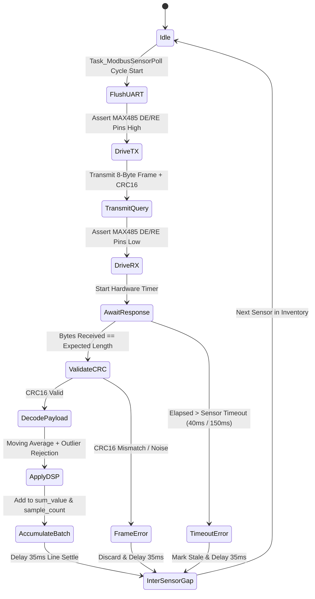
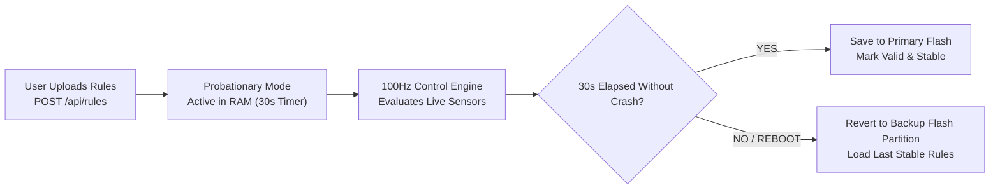

# Kontrx Universal Industrial Controller & Edge Gateway

<div align="center">

[](https://www.st.com/en/microcontrollers-microprocessors/stm32f407ve.html)
[](https://www.freertos.org/)
[](https://www.wiznet.io/product-item/w5500/)
[](https://sparkplug.eclipse.org/)
[](#-industrial-interfaces-motion--analog-subsystems)
[](#-executive-technical-summary)
[](LICENSE)

**An industrial-grade, multi-tasking edge gateway and universal automation controller engineered for real-time motion control (PTO/PWM), analog I/O (0–10V / 4–20mA), water quality monitoring (Modbus RTU), SD card event logging, and SCADA / Cloud IoT integration (Modbus TCP, Sparkplug B, MQTT).**

[System Architecture](#-system-architecture) •
[Hardware Specification](#-hardware-specifications--pinout) •
[RTOS Multi-Tasking](#-freertos-multi-tasking-architecture) •
[Memory & Storage](#-flash-memory--sd-card-architecture) •
[Modbus RTU & DSP Filtering](#-modbus-rtu-sensor-subsystem--dsp-filtering) •
[Motion & Analog Control](#-industrial-interfaces-motion--analog-subsystems) •
[Telemetry & Sparkplug B](#-cloud-telemetry--sparkplug-b-engine) •
[Rule Engine](#-edge-rule-engine--fail-safe-watchdog) •
[File-by-File Guide](#-complete-file-by-file-catalog) •
[Build & Flash](#-build--flashing-guide)

</div>

---

## 🌟 Executive Technical Summary

The **Kontrx Edge Gateway** is a universal industrial controller built on the **STM32F407VET6** (ARM Cortex-M4F with hardware single-precision FPU running at 168 MHz). It bridges field instrumentation, high-speed motion actuation, and enterprise IT/OT infrastructures:

* **Field Instrumentation**: RS485 Modbus RTU sensors (pH, ORP, EC, Dissolved Oxygen, Ammonia, Ultrasonic) with digital signal filtering (DSP).
* **Motion & Actuation**: 4-channel Pulse Train Output (PTO) for stepper/servo motors with hardware limit-switch interrupts, multi-channel PWM, 0–10V voltage output, 4–20mA current loop DAC, and 10 opto-isolated high-current relays.
* **Storage & Audit Logging**: Winbond W25Q16 (2 MB SPI NOR flash) for web assets, dual redundant configurations, rules, and offline telemetry ring buffer; dedicated SPI3 MicroSD card interface for multi-sector persistent audit logging and CSV exports.
* **Network & Industrial Protocols**: WIZnet W5500 hardwired TCP/IP with a self-healing network guard (`Ensure_W5500_Network_Alive`), embedded HTTP REST API & responsive Ignova-branded SPA (Light/Dark themes, dynamic QR code generator, and infinite scroll log viewer), Modbus TCP Server (Port 502), Modbus TCP Client (remote PLCs), and Eclipse Sparkplug B / MQTT telemetry engine.

```
┌───────────────────────────────────────────────────────────────────────────────────────────────────────┐
│                                       KONTRX UNIVERSAL CONTROLLER                                     │
│                                                                                                       │
│  [RS485 Modbus RTU] ────► [Noise-Filtered Poller] ──► [DSP Moving-Avg/Median] ──► [Sample Batch Avg] │
│          │                                                                                 │          │
│          ▼                                                                                 ▼          │
│  [100Hz Control Engine] ──► [16 Automation Rules] ──────────────┐              [Sparkplug B / MQTT]   │
│          │                                                      │                          │          │
│          ├──► [4x PTO Stepper/Servo] (TIM1 + EXTI Limits)       ▼                          ▼          │
│          ├──► [Multi-Channel PWM] (Industrial Timers)   [W25Q16 NOR Flash]        [W5500 SPI Ethernet]│
│          ├──► [0-10V Analog & 4-20mA Current DAC]       - Redundant Configs       - Responsive SPA    │
│          ├──► [10x Local Isolated Relays (NO/NC)]       - Offline Queue (512KB)   - REST API (Port 80)│
│          ├──► [Modbus TCP Server (Port 502)]            - Web Assets              - Modbus TCP Server │
│          └──► [Modbus TCP Client (Remote PLCs)]                 │                 - MQTT / SpB Engine │
│                                                                 ▼                 - Self-Healing Guard│
│                                                       [SPI3 MicroSD Card]                             │
│                                                       - Multi-Sector Logs                             │
│                                                       - Timestamped CSV Logs                          │
└───────────────────────────────────────────────────────────────────────────────────────────────────────┘
```

---

## 🏛️ System Architecture

```mermaid
graph TB
    subgraph FIELD["Field Layer & Industrial Actuators"]
        S_PH["pH Sensor (ID 1)"]
        S_ORP["ORP Sensor (ID 2)"]
        S_EC["EC Sensor (ID 3)"]
        S_DO["DO KWS-630 (ID 4)"]
        S_NH3["Ammonia Sensor (ID 5)"]
        S_US["Ultrasonic Array (ID 7)"]
        ACT_LOCAL["10x Local Isolated Relays"]
        ACT_PTO["4x Stepper/Servo (PTO)"]
        ACT_PWM["PWM Out (Pumps/Valves)"]
        ACT_DAC["0-10V / 4-20mA Transmitters"]
        ACT_PLC["Remote PLC (Modbus TCP Client)"]
    end

    subgraph HARDWARE["STM32F407VET6 Microcontroller"]
        subgraph MCAL["Microcontroller Abstraction Layer (MCAL)"]
            M_GPIO["gpio_stm32.c<br/>(Ports A–E, Moder, BSRR)"]
            M_UART["uart_stm32.c / uart2_stm32.c<br/>(USART1 Console, USART3 Modbus, USART2)"]
            M_SPI["spi_stm32.c / spi3_stm32.c<br/>(SPI1 Flash, SPI2 W5500, SPI3 SD)"]
            M_TIM["timer_stm32.c<br/>(TIM1 Advanced, TIM2-TIM4 General)"]
            M_EXTI["exti_stm32.c<br/>(EXTI0-EXTI7 Limit Switches)"]
            M_FLASH["flash_stm32.c<br/>(Internal Flash Controller)"]
            M_RTC["rtc_stm32.c<br/>(Hardware RTC & Unix Epoch)"]
            M_RCC["rcc_stm32.c<br/>(Reset & Clock Control)"]
        end

        subgraph HAL["Hardware Abstraction Layer (HAL)"]
            H_MODBUS["modbus_dma.c<br/>(RTU Parser, DCBA Float, Auto-Scan)"]
            H_MODBUS_S["modbus_tcp_server.c<br/>(Modbus TCP Server Port 502)"]
            H_PTO["pto_motion.c<br/>(4x PTO Motor Controller)"]
            H_PWM["pwm_controller.c<br/>(Multi-Channel Industrial PWM)"]
            H_ANALOG["analog_010v.c / dac_420ma.c<br/>(Analog 0-10V & 4-20mA Output)"]
            H_SD["sdcard.c<br/>(SPI3 MicroSD Card Storage)"]
            H_FLASH["flash_partition.c<br/>(W25Q16 Partition Manager)"]
            H_PLC["plc_control.c<br/>(Modbus TCP Client Socket 4)"]
            H_DISC["interface_discovery.c<br/>(Peripheral Capability Scanner)"]
            H_W25Q["w25q16.c<br/>(2MB SPI NOR Flash Driver)"]
            H_LED["led.c<br/>(Status Indicator PA6)"]
        end

        subgraph RTOS["FreeRTOS Kernel (CMSIS-RTOS2)"]
            T_CTRL["Task_ControlEngine<br/>Priority: Realtime (5)<br/>10ms (100Hz) Cycle"]
            T_MQTT["Task_MQTTClient<br/>Priority: High (4)<br/>Sparkplug B / Dynamic JSON / Guard"]
            T_MODBUS["Task_ModbusSensorPoll<br/>Priority: Normal (3)<br/>DSP Filter & Round-Robin"]
            T_HTTP["Task_HTTPServer<br/>Priority: Normal (2)<br/>REST API & SPA Dashboard"]
            T_OTA["Task_OTAUpdate<br/>Priority: Low (1)<br/>CRC32 Validation & Boot Swap"]
        end

        subgraph IPC["Thread Synchronization & Mutexes"]
            MUT_SENSOR["sensorMutex<br/>Guards Modbus_SensorData_t"]
            MUT_CONFIG["configMutex<br/>Guards Gateway_Config_t"]
            MUT_RULES["rulesMutex<br/>Guards RuleConfig_t"]
            MUT_SPI["spiMutex<br/>Recursive Hardware SPI2 Guard"]
        end
    end

    subgraph CLOUD["Enterprise, SCADA & Web Clients"]
        BROKER["MQTT Broker / EMQX / HiveMQ<br/>(spBv1.0 Topic Architecture)"]
        BROWSER["Web Browser / Client<br/>(Ignova Dark/Light SPA Dashboard)"]
        SCADA["SCADA / Ignition / Node-RED<br/>(Modbus TCP Port 502)"]
    end

    S_PH & S_ORP & S_EC & S_DO & S_NH3 & S_US <==>|RS485 Half-Duplex| M_UART
    M_UART ==> H_MODBUS ==> T_MODBUS
    T_MODBUS ==>|Update Readings + DSP| MUT_SENSOR
    MUT_SENSOR ==>|Atomic Snapshot| T_CTRL & T_MQTT & T_HTTP

    T_CTRL ==>|Direct GPIO| M_GPIO ==> ACT_LOCAL
    T_CTRL ==>|PTO Pulses| H_PTO ==> ACT_PTO
    T_CTRL ==>|PWM Waves| H_PWM ==> ACT_PWM
    T_CTRL ==>|Analog Volt/Curr| H_ANALOG ==> ACT_DAC
    T_CTRL ==>|Socket 4 Client| H_PLC ==> ACT_PLC

    T_MQTT ==>|Sparkplug B / MQTT| M_SPI ==> BROKER
    T_HTTP ==>|HTTP / JSON Stream| M_SPI ==> BROWSER
    H_MODBUS_S <==>|Port 502 Socket| SCADA
```



---

## 🔌 Hardware Specifications & Pinout

### 1. Board & Core Peripherals

| Component | Specification | Interface / Bus |
|---|---|---|
| **MCU** | STM32F407VET6 (ARM Cortex-M4F @ 168MHz, 512KB Flash, 192KB SRAM) | Internal Bus Matrix |
| **Ethernet** | WIZnet W5500 Hardwired TCP/IP (8 Sockets, 32KB Buffer) | SPI2 @ 21 MHz (`PB12`–`PB15`) |
| **RS485 Transceiver** | MAX485 Half-Duplex with HW Direction Control | USART3 (`PB10`/`PB11`), DE=`PD3`, RE#=`PD2` |
| **SPI Flash (NOR)** | Winbond W25Q16 (16 Mbit / 2 MB SPI NOR Flash) | SPI1 (`PB0` CS, `PB3` SCK, `PB4` MISO, `PB5` MOSI) |
| **MicroSD Storage** | High-Capacity SPI SD Card for multi-sector event & audit logs | SPI3 (`PC10` SCK, `PC11` MISO, `PC12` MOSI, `PD0`/`PD1` CS) |
| **Debug Console** | Dedicated USART1 Serial Bridge (115200 8N1) | USART1 (`PA9` TX, `PA10` RX) & USART6 (`PC6`/`PC7`) |
| **Local Relays** | 10 Channels with Optocoupler Isolation & Inversion Config | Direct High-Current GPIO Push-Pull |
| **PTO Motion** | 4-Axis Pulse Train Output with Direction & Limit inputs | TIM1 Channels (`PE8`–`PE15`) + EXTI (`PE0`, `PE1`, `PE3`, `PE7`) |
| **Analog I/O** | 0–10V Voltage & 4–20mA Current DAC Interfaces | Dedicated Industrial Analog Front-End |
| **Real-Time Clock** | STM32 Internal RTC with LSE Crystal (32.768 kHz) | PC14 (`OSC32_IN`), PC15 (`OSC32_OUT`) |

---

### 2. Microcontroller Pin Mapping Table

| Pin | Port ID | Function | Peripheral | Mode | Description |
|---|---|---|---|---|---|
| **PA0** | Port A (0) | Relay 6 Output | GPIO | Output Push-Pull | Default Actuator #6 |
| **PA1** | Port A (0) | Relay 7 Output | GPIO | Output Push-Pull | Default Actuator #7 |
| **PA2** | Port A (0) | Relay 8 Output | GPIO | Output Push-Pull | Default Actuator #8 |
| **PA4** | Port A (0) | Relay 9 Output | GPIO | Output Push-Pull | Default Actuator #9 |
| **PA6** | Port A (0) | Status LED | GPIO | Output Push-Pull | System Activity & Heartbeat LED |
| **PA9** | Port A (0) | Debug UART TX | USART1 | Alternate Function 7 | Serial `printf` Console (115200 8N1) |
| **PA10** | Port A (0) | Debug UART RX | USART1 | Alternate Function 7 | Serial RX Console |
| **PA13** | Port A (0) | SWD SWDIO | SWD | Dedicated | Hardware Programming & Debug |
| **PA14** | Port A (0) | SWD SWCLK | SWD | Dedicated | Hardware Programming Clock |
| **PB0** | Port B (1) | W25Q16 Chip Select | GPIO | Output Push-Pull | Active-Low SPI NOR Flash CS |
| **PB3** | Port B (1) | SPI1 SCK | SPI1 | Alternate Function 5 | External Flash Clock |
| **PB4** | Port B (1) | SPI1 MISO | SPI1 | Alternate Function 5 | External Flash Master In Slave Out |
| **PB5** | Port B (1) | SPI1 MOSI | SPI1 | Alternate Function 5 | External Flash Master Out Slave In |
| **PB10** | Port B (1) | Modbus TX | USART3 | Alternate Function 7 | RS485 Transmit |
| **PB11** | Port B (1) | Modbus RX | USART3 | Alternate Function 7 | RS485 Receive |
| **PB12** | Port B (1) | W5500 Chip Select | GPIO | Output Push-Pull | Active-Low W5500 Ethernet CS |
| **PB13** | Port B (1) | SPI2 SCK | SPI2 | Alternate Function 5 | W5500 Ethernet Clock @ 21 MHz |
| **PB14** | Port B (1) | SPI2 MISO | SPI2 | Alternate Function 5 | W5500 Ethernet Master In Slave Out |
| **PB15** | Port B (1) | SPI2 MOSI | SPI2 | Alternate Function 5 | W5500 Ethernet Master Out Slave In |
| **PC0** | Port C (2) | Relay 4 Output | GPIO | Output Push-Pull | Default Actuator #4 |
| **PC2** | Port C (2) | Relay 5 Output | GPIO | Output Push-Pull | Default Actuator #5 |
| **PC4** | Port C (2) | Relay 10 Output | GPIO | Output Push-Pull | Default Actuator #10 |
| **PC6** | Port C (2) | Aux Console TX | USART6 | Alternate Function 8 | Auxiliary Console TX |
| **PC7** | Port C (2) | Aux Console RX | USART6 | Alternate Function 8 | Auxiliary Console RX |
| **PC10** | Port C (2) | SPI3 SCK | SPI3 | Alternate Function 6 | SD Card Clock |
| **PC11** | Port C (2) | SPI3 MISO | SPI3 | Alternate Function 6 | SD Card Master In Slave Out |
| **PC12** | Port C (2) | SPI3 MOSI | SPI3 | Alternate Function 6 | SD Card Master Out Slave In |
| **PC14** | Port C (2) | LSE OSC32_IN | RTC | Dedicated | 32.768 kHz RTC Crystal |
| **PC15** | Port C (2) | LSE OSC32_OUT | RTC | Dedicated | 32.768 kHz RTC Crystal |
| **PD0** | Port D (3) | SD Card CS | GPIO | Output Push-Pull | Active-Low MicroSD Card Select |
| **PD2** | Port D (3) | MAX485 RE# | GPIO | Output Push-Pull | Receiver Enable (Active Low) |
| **PD3** | Port D (3) | MAX485 DE | GPIO | Output Push-Pull | Driver Enable (Active High) |
| **PD8** | Port D (3) | Relay 11 / Spare | GPIO | Output Push-Pull | Default Actuator #11 |
| **PE0** | Port E (4) | PTO1 Limit Switch | EXTI | Input Pull-Up | Emergency Stop / Limit Switch 1 |
| **PE1** | Port E (4) | PTO2 Limit Switch | EXTI | Input Pull-Up | Emergency Stop / Limit Switch 2 |
| **PE2** | Port E (4) | Relay 1 Output | GPIO | Output Push-Pull | Default Actuator #1 |
| **PE3** | Port E (4) | PTO3 Limit Switch | EXTI | Input Pull-Up | Emergency Stop / Limit Switch 3 |
| **PE4** | Port E (4) | Relay 2 Output | GPIO | Output Push-Pull | Default Actuator #2 |
| **PE6** | Port E (4) | Relay 3 Output | GPIO | Output Push-Pull | Default Actuator #3 |
| **PE7** | Port E (4) | PTO4 Limit Switch | EXTI | Input Pull-Up | Emergency Stop / Limit Switch 4 |
| **PE8** | Port E (4) | PTO1 DIR | GPIO | Output Push-Pull | Stepper/Servo 1 Direction |
| **PE9** | Port E (4) | PTO1 PUL | TIM1 | Alternate Function 1 | TIM1_CH1 High-Speed Pulse Train |
| **PE10** | Port E (4) | PTO2 DIR | GPIO | Output Push-Pull | Stepper/Servo 2 Direction |
| **PE11** | Port E (4) | PTO2 PUL | TIM1 | Alternate Function 1 | TIM1_CH2 High-Speed Pulse Train |
| **PE12** | Port E (4) | PTO3 DIR | GPIO | Output Push-Pull | Stepper/Servo 3 Direction |
| **PE13** | Port E (4) | PTO3 PUL | TIM1 | Alternate Function 1 | TIM1_CH3 High-Speed Pulse Train |
| **PE15** | Port E (4) | PTO4 DIR | GPIO | Output Push-Pull | Stepper/Servo 4 Direction |
| **PE14** | Port E (4) | PTO4 PUL | TIM1 | Alternate Function 1 | TIM1_CH4 High-Speed Pulse Train |
| **PH0** | Port H (7) | HSE OSC_IN | RCC | Dedicated | High-Speed External Crystal (8–25 MHz) |
| **PH1** | Port H (7) | HSE OSC_OUT | RCC | Dedicated | High-Speed External Crystal |

---

## ⚡ FreeRTOS Multi-Tasking Architecture

The firmware utilizes **FreeRTOS v10** under the ARM CMSIS-RTOS2 abstraction API. Five tasks execute concurrently to handle real-time control, sensor polling, networking, logging, and security:

```
┌───────────────────────┬──────────┬──────────┬─────────────┬──────────────────────────────────────────┐
│ Task Name             │ Priority │ Stack    │ Period      │ Core Responsibilities                   │
├───────────────────────┼──────────┼──────────┼─────────────┼──────────────────────────────────────────┤
│ Task_ControlEngine    │ RT (5)   │ 6,144 B  │ 10ms (100Hz)│ Executes 16 user automation rules in RAM;│
│                       │          │          │             │ controls GPIOs, PTO, PWM, and Modbus TCP.│
├───────────────────────┼──────────┼──────────┼─────────────┼──────────────────────────────────────────┤
│ Task_MQTTClient       │ High (4) │ 8,192 B  │ Dynamic /   │ Manages MQTT session, Sparkplug B Protobuf│
│                       │          │          │ CoV / 1–60s │ dynamic JSON payloads & self-healing net.│
├───────────────────────┼──────────┼──────────┼─────────────┼──────────────────────────────────────────┤
│ Task_ModbusSensorPoll │ Norm (3) │ 4,096 B  │ Continuous  │ Round-robin RS485 queries; noise-filter; │
│                       │          │          │ (~275ms)    │ DSP moving average & outlier rejection.  │
├───────────────────────┼──────────┼──────────┼─────────────┼──────────────────────────────────────────┤
│ Task_HTTPServer       │ Norm (2) │ 12,288 B │ Event-driven│ Serves Ignova SPA dashboard; REST API;   │
│                       │          │          │             │ SD card log pagination & chunked OTA.    │
├───────────────────────┼──────────┼──────────┼─────────────┼──────────────────────────────────────────┤
│ Task_OTAUpdate        │ Low (1)  │ 4,096 B  │ Event-driven│ Computes CRC32 of staging flash, validates│
│                       │          │          │             │ Cortex-M4 SP, and arms bootloader jump.  │
└───────────────────────┴──────────┴──────────┴─────────────┴──────────────────────────────────────────┘
```

### Critical Thread Synchronization Rules
1. **SPI Mutex (`spiMutex`)**: Because both `Task_HTTPServer` (Socket 0) and `Task_MQTTClient` (Socket 1) communicate over SPI2 to the W5500 controller, all WIZnet socket operations are guarded by `xSemaphoreCreateRecursiveMutex()`. This completely prevents SPI transaction interleaving and eliminates socket timeout faults.
2. **Sensor Mutex (`sensorMutex`)**: Protects `Modbus_SensorData_t`. The Control Engine reads this snapshot non-blockingly using `osMutexAcquire(sensorMutex, 0)`, ensuring that real-time automation is never blocked by RS485 bus delays.
3. **Network Guard (`Ensure_W5500_Network_Alive`)**: Actively verifies W5500 physical link status and hardware register contents. If link flap or register corruption occurs, it automatically re-initializes network parameters (`192.168.1.200`) without resetting the RTOS kernel.

---

## 💾 Flash Memory & SD Card Architecture

### 1. Internal Flash Layout (STM32F407VET6 — 512 KB)

```
0x08000000 ┌────────────────────────────────────────────────────────┐
           │ Sector 0 (16 KB)  : Stage-1 Bootloader (Bootloader.bin)│
0x08004000 ├────────────────────────────────────────────────────────┤
           │ Sector 1 (16 KB)  : OTA Metadata (Magic 0xC01D0001)    │
0x08008000 ├────────────────────────────────────────────────────────┤
           │ Sectors 2–5 (224KB): Active Application (KontrxRTOS)   │
0x08040000 ├────────────────────────────────────────────────────────┤
           │ Sectors 6–7 (256KB): Firmware Staging Buffer (OTA)     │
0x0807C000 ├────────────────────────────────────────────────────────┤
           │ Sector 7 Tail     : Internal Flash Backup Config       │
0x08080000 └────────────────────────────────────────────────────────┘
```

---

### 2. External SPI NOR Flash Partitions (Winbond W25Q16 — 2 MB)

```
0x00000000 ┌────────────────────────────────────────────────────────┐
           │ Partition 0: Web Assets (512 KB) — Sectors 0–127       │
           │ Embedded HTML5, CSS3, JavaScript, and SPA Resources    │
0x00080000 ├────────────────────────────────────────────────────────┤
           │ Partition 1: Redundant Configuration & Rules (16 KB)   │
           │   - 0x080000 (Sec 128): Primary Gateway Configuration  │
           │   - 0x081000 (Sec 129): Backup Gateway Configuration   │
           │   - 0x082000 (Sec 130): Primary Automation Rules       │
           │   - 0x083000 (Sec 131): Backup Stable Automation Rules │
0x00084000 ├────────────────────────────────────────────────────────┤
           │ Partition 2: Offline Telemetry Queue (512 KB)          │
           │ Sectors 132–259: 32,768 Slots × 16-byte FIFO Ring      │
0x00104000 ├────────────────────────────────────────────────────────┤
           │ Partition 3: Persistent Multi-Sector Audit Logs (1008KB│
           │ Sectors 260–511: Wrap-around Circular Event Logger     │
0x00200000 └────────────────────────────────────────────────────────┘
```

---

### 3. SPI3 MicroSD Card Storage Subsystem

* **Interface**: SPI3 Master (`PC10` SCK, `PC11` MISO, `PC12` MOSI, `PD0` CS).
* **Multi-Sector Logging**: Automatically synchronizes audit logs and sensor telemetry events to SD card storage with hardware RTC timestamps.
* **REST Export**: The web dashboard allows downloading historical logs in CSV format or streaming them through `/api/logs` with dynamic scroll pagination.

---

## 🌊 Modbus RTU Sensor Subsystem & DSP Filtering

Field sensors connect over RS485 at 9600 baud (8N1). Queries use an active noise-rejection state machine with timeout-per-sensor scheduling:



### Sensor Specifications & Decoding Formulas

| Type | Sensor Description | Register | Count | Data Format | Math Conversion | Timeout |
|---|---|---|---|---|---|---|
| **1** | **pH Sensor** | `0x0000` | 2 | 16-bit Int | $\text{pH} = \frac{\text{reg}[0]}{100.0}$, $\text{Temp} = \frac{\text{reg}[1]}{100.0}$ | 40 ms |
| **2** | **ORP Sensor** | `0x0000` | 2 | 16-bit Int | $\text{ORP} = \text{reg}[0]\text{ mV}$, $\text{Temp} = \frac{\text{reg}[1]}{100.0}$ | 40 ms |
| **3** | **EC Sensor** | `0x0000` | 2 | 16-bit Int | $\text{EC} = \frac{\text{reg}[0]}{10.0}\text{ }\mu\text{S/cm}$, $\text{Temp} = \frac{\text{reg}[1]}{100.0}$ | 40 ms |
| **4** | **DO (KWS-630)** | `0x2600` | 6 | IEEE-754 DCBA | $\text{Temp} = \text{Decode}_{\text{DCBA}}(\text{reg}[0..1])$, $\text{DO} = \text{Decode}_{\text{DCBA}}(\text{reg}[4..5])$ | 150 ms |
| **5** | **Ammonia Sensor** | `0x0000` | 2 | 16-bit Int | $\text{Ammonia} = \text{reg}[0]\text{ mg/L}$, $\text{Temp} = \frac{\text{reg}[1]}{100.0}$ | 40 ms |
| **6** | **Single Ultrasonic**| `0x0000` | 10 | 16-bit Int | $\text{Temp} = \frac{\text{reg}[8]}{10.0}$, $\text{Distance} = \frac{\text{reg}[9]}{10.0}\text{ mm}$ | 40 ms |
| **7** | **Multi-US Array** | `ch * 0x10`| 3 | 16-bit Int | 8 channels polled round-robin (2 per cycle, 15ms gap) | 40 ms |

### Digital Signal Processing (`dsp_filter.c`)
To ensure high telemetry reliability in harsh industrial environments:
* **Windowed Moving Average**: Filters high-frequency acoustic and electrical noise.
* **Median Filtering**: Eliminates transient spikes and electromagnetic interference from relay switches.
* **Outlier Rejection**: Rejects physical reading jumps exceeding realistic physical rates of change.

---

## 🚀 Industrial Interfaces: Motion & Analog Subsystems

Kontrx provides high-speed motion actuation and analog interfacing:

### 1. Pulse Train Output (PTO) Motion Control (`pto_motion.c`)
* **4 Independent Channels**: Powered by Advanced Timer **TIM1** (`PE9`, `PE11`, `PE13`, `PE14`).
* **Direction Outputs**: Dedicated push-pull GPIOs (`PE8`, `PE10`, `PE12`, `PE15`).
* **Hardware Limit Switches**: Dedicated inputs on `PE0`, `PE1`, `PE3`, `PE7` hooked directly to **EXTI** lines for zero-latency motion halts when limits are tripped.
* **Features**: Dynamic acceleration/deceleration ramps, target pulse counting, continuous velocity mode, homing routine, and interactive position tracking.

### 2. Industrial Multi-Channel PWM (`pwm_controller.c`)
* Configurable frequency and duty cycle (0.0% – 100.0%) for proportional valve control, variable-speed dosing pumps, and solid-state actuators.

### 3. Analog I/O & Current Loop (`analog_010v.c` / `dac_420ma.c`)
* **0–10V Analog Output**: Industrial standard voltage output for speed drives (VFDs) and motorized dampers.
* **4–20mA Current DAC**: High-precision current-loop transmitter with fault detection.

### 4. Modbus TCP Server (`modbus_tcp_server.c`)
* Listens on **Port 502** to allow SCADA systems (Ignition, Wonderware, Node-RED) to read gateway sensors, monitor relay coils, and issue remote setpoint commands directly.

---

## 📡 Cloud Telemetry & Sparkplug B Engine

The gateway natively serializes telemetry using the **Eclipse Sparkplug B** specification in binary Google Protocol Buffers format without dynamic heap allocation.

### Sparkplug B Message Types
1. **NBIRTH (Node Birth)**: Published upon connecting to the broker. Announces gateway identity (`kontrx-0000002`), firmware version, full sensor inventory, and actuator metadata.
2. **DDATA (Device Data)**: Published periodically (or on Change-of-Value / CoV). Contains mathematical average of all samples accumulated since the previous transmission.
3. **NDEATH (Node Death)**: Registered as the MQTT Last Will and Testament (LWT) on topic `spBv1.0/KontrxGroup/NDEATH/kontrx-0000002`.

### Dynamic MQTT Payload Shaping
In addition to Sparkplug B, Kontrx supports dynamic JSON payloads with customizable keys, metric mappings, and configurable publish intervals (`1s`–`60s`).

### Offline Telemetry Ring Queue
If the Ethernet link drops or the MQTT broker becomes unreachable:
* Telemetry is automatically diverted to the **512 KB SPI Flash FIFO Queue** (`PARTITION_QUEUE_ADDR`).
* Up to **32,768 records** are buffered with microsecond RTC timestamps.
* Once connectivity is restored, the queue is flushed in chronological order before live telemetry resumes.

---

## ⚙️ Edge Rule Engine & Fail-Safe Watchdog

The Control Engine evaluates up to 16 user-defined automation rules every 10 ms (100 Hz):

```
Rule Definition:
IF [input_id: "ph"] [operator: "<"] [threshold: 6.5]
THEN SET [output_id: "Relay_1"] TO [action: "ON"]
```



---

## 📂 Complete File-by-File Catalog

For exhaustive documentation of every file, see [docs/FILE_STRUCTURE_GUIDE.md](docs/FILE_STRUCTURE_GUIDE.md).

### Summary Table

| Path | Category | Description |
|---|---|---|
| [`APP/main_kontrx.c`](APP/main_kontrx.c) | Core Entry | Master application entry point; initializes MCAL, W5500, partitions, and starts RTOS scheduler. |
| [`APP/freertos_tasks.c`](APP/freertos_tasks.c) | Application | FreeRTOS tasks implementation, IPC coordinator, rule engine, SD card sync, network guard, and MQTT client task. |
| [`APP/freertos_tasks.h`](APP/freertos_tasks.h) | Application | Task prototypes, CPU DWT measurement headers, and system status structures. |
| [`APP/http_server_task.c`](APP/http_server_task.c) | Application | REST API HTTP server on Port 80; handles SPA streaming, SD log pagination, and OTA uploads. |
| [`APP/http_server_task.h`](APP/http_server_task.h) | Application | HTTP server prototypes, OTA inter-task semaphores, and debug structures. |
| [`APP/dsp_filter.c`](APP/dsp_filter.c) | DSP Filter | Moving average, median filter, and outlier rejection algorithms for noisy sensors. |
| [`APP/dsp_filter.h`](APP/dsp_filter.h) | DSP Filter | DSP filter configuration structures and prototypes. |
| [`APP/sparkplug_b_enc.c`](APP/sparkplug_b_enc.c) | Application | Zero-heap binary Protobuf serializer for Sparkplug B (NBIRTH, DDATA, NDEATH). |
| [`APP/sparkplug_b_enc.h`](APP/sparkplug_b_enc.h) | Application | Sparkplug B encoder interface and metric data types. |
| [`APP/ota_task.c`](APP/ota_task.c) | Application | Background OTA task; validates CRC32, checks ARM SP, and writes bootloader metadata. |
| [`APP/ota_task.h`](APP/ota_task.h) | Application | OTA flash partition layouts and metadata structures. |
| [`APP/bootloader.c`](APP/bootloader.c) | Bootloader | Stage-1 bare-metal bootloader @ `0x08000000`; copies staging binary to app flash. |
| [`APP/cJSON.c`](APP/cJSON.c) | Utility | Ultralight ANSI C JSON parser mapped to FreeRTOS heap memory functions. |
| [`APP/cJSON.h`](APP/cJSON.h) | Utility | cJSON function headers and prototypes. |
| [`APP/cmsis_os2.c`](APP/cmsis_os2.c) | OS Wrapper | CMSIS-RTOS2 API implementation over FreeRTOS kernel primitives. |
| [`APP/cmsis_os2.h`](APP/cmsis_os2.h) | OS Wrapper | Standard CMSIS-RTOS2 API declarations. |
| [`APP/web_assets.h`](APP/web_assets.h) | Frontend | Embedded responsive SPA dashboard (Light/Dark themes, dynamic QR code, log pagination). |
| [`HAL/modbus_dma.c`](HAL/modbus_dma.c) | HAL Driver | Modbus RTU poller, noise filter, DCBA float decoder, and 1–247 scan engine. |
| [`HAL/modbus_dma.h`](HAL/modbus_dma.h) | HAL Driver | Sensor structs, actuator configs, and shared RTOS memory prototypes. |
| [`HAL/modbus_tcp_server.c`](HAL/modbus_tcp_server.c) | HAL Driver | Modbus TCP Server on Port 502 for remote SCADA integration. |
| [`HAL/modbus_tcp_server.h`](HAL/modbus_tcp_server.h) | HAL Driver | Modbus TCP Server prototypes and holding register map. |
| [`HAL/pto_motion.c`](HAL/pto_motion.c) | HAL Driver | 4-channel Pulse Train Output (PTO) stepper/servo motor driver with limit switches. |
| [`HAL/pto_motion.h`](HAL/pto_motion.h) | HAL Driver | PTO motion controller structures, speed profiles, and API definitions. |
| [`HAL/pwm_controller.c`](HAL/pwm_controller.c) | HAL Driver | Multi-channel industrial PWM driver with dynamic frequency and duty cycle control. |
| [`HAL/pwm_controller.h`](HAL/pwm_controller.h) | HAL Driver | PWM controller initialization and duty adjustment headers. |
| [`HAL/analog_010v.c`](HAL/analog_010v.c) | HAL Driver | 0–10V industrial analog output driver for VFDs and actuators. |
| [`HAL/analog_010v.h`](HAL/analog_010v.h) | HAL Driver | 0–10V interface prototypes. |
| [`HAL/dac_420ma.c`](HAL/dac_420ma.c) | HAL Driver | 4–20mA current loop DAC driver for industrial field transmitters. |
| [`HAL/dac_420ma.h`](HAL/dac_420ma.h) | HAL Driver | 4–20mA current loop prototypes. |
| [`HAL/sdcard.c`](HAL/sdcard.c) | HAL Driver | MicroSD card driver over SPI3 for multi-sector event logging and CSV exports. |
| [`HAL/sdcard.h`](HAL/sdcard.h) | HAL Driver | SD card SPI communication prototypes and status flags. |
| [`HAL/flash_partition.c`](HAL/flash_partition.c) | HAL Driver | W25Q16 partition manager; dual-sector config/rules, 512KB queue, and audit logger. |
| [`HAL/flash_partition.h`](HAL/flash_partition.h) | HAL Driver | External SPI flash memory map and partition API headers. |
| [`HAL/interface_discovery.c`](HAL/interface_discovery.c) | HAL Driver | Dynamic peripheral capability scanner and interface auto-discovery. |
| [`HAL/interface_discovery.h`](HAL/interface_discovery.h) | HAL Driver | Discovery structures and register enumeration APIs. |
| [`HAL/plc_control.c`](HAL/plc_control.c) | HAL Driver | Modbus TCP Client (Socket 4, FC5 Write Single Coil) for remote PLCs. |
| [`HAL/plc_control.h`](HAL/plc_control.h) | HAL Driver | PLC control interface definitions. |
| [`HAL/w25q16.c`](HAL/w25q16.c) | HAL Driver | Low-level SPI driver for Winbond W25Q16 2MB NOR flash. |
| [`HAL/w25q16.h`](HAL/w25q16.h) | HAL Driver | W25Q16 SPI command definitions and registers. |
| [`HAL/led.c`](HAL/led.c) | HAL Driver | Board status LED driver on GPIO PA6. |
| [`HAL/led.h`](HAL/led.h) | HAL Driver | LED control prototypes. |
| [`MCAL/STM32F4/stm32f407_regs.h`](MCAL/STM32F4/stm32f407_regs.h) | MCAL Driver | Complete bare-metal register map for STM32F407 (RCC, GPIO, SPI, USART, TIM, EXTI). |
| [`MCAL/STM32F4/gpio_stm32.c`](MCAL/STM32F4/gpio_stm32.c) | MCAL Driver | GPIO pin initialization, alternate functions, and pin reservation validation. |
| [`MCAL/STM32F4/gpio_stm32.h`](MCAL/STM32F4/gpio_stm32.h) | MCAL Driver | GPIO port pointers and register manipulation macros. |
| [`MCAL/STM32F4/uart_stm32.c`](MCAL/STM32F4/uart_stm32.c) | MCAL Driver | Register-level USART1 (Debug 115200) and USART3 (Modbus 9600) driver. |
| [`MCAL/STM32F4/uart_stm32.h`](MCAL/STM32F4/uart_stm32.h) | MCAL Driver | UART initialization and byte transmission headers. |
| [`MCAL/STM32F4/uart2_stm32.c`](MCAL/STM32F4/uart2_stm32.c) | MCAL Driver | Register-level USART2 driver for auxiliary communication. |
| [`MCAL/STM32F4/uart2_stm32.h`](MCAL/STM32F4/uart2_stm32.h) | MCAL Driver | USART2 initialization prototypes. |
| [`MCAL/STM32F4/spi_stm32.c`](MCAL/STM32F4/spi_stm32.c) | MCAL Driver | Register-level SPI1 (Flash) and SPI2 (W5500) master driver. |
| [`MCAL/STM32F4/spi_stm32.h`](MCAL/STM32F4/spi_stm32.h) | MCAL Driver | SPI transmission prototypes. |
| [`MCAL/STM32F4/spi3_stm32.c`](MCAL/STM32F4/spi3_stm32.c) | MCAL Driver | Register-level SPI3 master driver dedicated to MicroSD card storage. |
| [`MCAL/STM32F4/spi3_stm32.h`](MCAL/STM32F4/spi3_stm32.h) | MCAL Driver | SPI3 interface prototypes. |
| [`MCAL/STM32F4/timer_stm32.c`](MCAL/STM32F4/timer_stm32.c) | MCAL Driver | TIM1 Advanced and general-purpose timer driver for PWM and PTO pulses. |
| [`MCAL/STM32F4/timer_stm32.h`](MCAL/STM32F4/timer_stm32.h) | MCAL Driver | Timer configuration prototypes. |
| [`MCAL/STM32F4/exti_stm32.c`](MCAL/STM32F4/exti_stm32.c) | MCAL Driver | External interrupt lines driver for zero-latency limit switches. |
| [`MCAL/STM32F4/exti_stm32.h`](MCAL/STM32F4/exti_stm32.h) | MCAL Driver | EXTI configuration headers. |
| [`MCAL/STM32F4/rcc_stm32.c`](MCAL/STM32F4/rcc_stm32.c) | MCAL Driver | Reset & Clock Control driver (PLL, HSI, HSE, peripheral clock gates). |
| [`MCAL/STM32F4/rcc_stm32.h`](MCAL/STM32F4/rcc_stm32.h) | MCAL Driver | RCC peripheral clock control macros. |
| [`MCAL/STM32F4/flash_stm32.c`](MCAL/STM32F4/flash_stm32.c) | MCAL Driver | Internal STM32 flash sector erase and 32-bit word programming driver. |
| [`MCAL/STM32F4/flash_stm32.h`](MCAL/STM32F4/flash_stm32.h) | MCAL Driver | Internal flash unlock and write headers. |
| [`MCAL/STM32F4/rtc_stm32.c`](MCAL/STM32F4/rtc_stm32.c) | MCAL Driver | Hardware RTC driver with backup domain unlocking and Unix epoch conversion. |
| [`MCAL/STM32F4/rtc_stm32.h`](MCAL/STM32F4/rtc_stm32.h) | MCAL Driver | RTC time read and initialization prototypes. |
| [`CMakeLists.txt`](CMakeLists.txt) | Build System | Master CMake file defining compiler flags, linker scripts, and targets. |
| [`arm_toolchain.cmake`](arm_toolchain.cmake) | Build System | GNU Arm Embedded Toolchain configuration. |
| [`bootloader.ld`](bootloader.ld) | Linker Script | Memory layout for Stage-1 Bootloader @ `0x08000000` (16 KB). |
| [`app_ota.ld`](app_ota.ld) | Linker Script | Memory layout for OTA Application @ `0x08008000` (224 KB). |
| [`stm32f407vet6.ld`](stm32f407vet6.ld) | Linker Script | Monolithic 512 KB linker script. |
| [`startup_stm32f407xx.c`](startup_stm32f407xx.c) | Startup | Reset vector table, FPU enabler, and C runtime initialization. |
| [`FreeRTOSConfig.h`](FreeRTOSConfig.h) | OS Config | Kernel configuration, heap size (44KB), tick rate (1000Hz), and DWT trace hooks. |
| [`control_relays.py`](control_relays.py) | Script | Python script to cycle/test relays continuously over the REST API. |
| [`decode_sparkplug.py`](decode_sparkplug.py) | Script | Python script to subscribe to MQTT broker and decode Sparkplug B Protobuf messages. |
| [`test_float_decode.py`](test_float_decode.py) | Test Suite | TDD test verifying Little-Endian DCBA float decoding for the DO sensor. |
| [`test_sparkplug_and_mqtt.py`](test_sparkplug_and_mqtt.py) | Test Suite | Verification script for MQTT payload publishing and Sparkplug B decoding. |

---

## 🛠️ Build & Flashing Guide

### Prerequisites
* **CMake** (v3.10 or newer)
* **GNU Arm Embedded Toolchain** (`arm-none-eabi-gcc` v10.3+)
* **Ninja** or **Make**
* **ST-Link v2 / v3** or **J-Link** programmer

---

### 1. Compile All Targets

```bash
# Configure build directory with arm toolchain
cmake -B build -DCMAKE_TOOLCHAIN_FILE=arm_toolchain.cmake -G Ninja

# Build all binaries
cmake --build build
```

Generated artifacts in `build/`:
* `Bootloader.bin` — Stage-1 Bootloader (`0x08000000`)
* `KontrxRTOS.bin` & `KontrxRTOS.hex` — Production RTOS Application (`0x08008000`)
* `RS485_Diag.bin` — Standalone RS485 diagnostic tool

---

### 2. Flashing via ST-Link / OpenOCD

#### Initial Board Provisioning (Flash Once via ST-Link):
```bash
# 1. Flash Bootloader to Sector 0
openocd -f interface/stlink.cfg -f target/stm32f4x.cfg \
  -c "program build/Bootloader.bin 0x08000000 verify reset exit"

# 2. Flash KontrxRTOS Application to Sector 2
openocd -f interface/stlink.cfg -f target/stm32f4x.cfg \
  -c "program build/KontrxRTOS.bin 0x08008000 verify reset exit"
```

---

### 3. Field Firmware Updates (Over-The-Air / OTA)

Once the bootloader is installed, future updates require zero physical access:
1. Open the dashboard at `http://192.168.1.200`.
2. Navigate to the **OTA Firmware Update** panel.
3. Enter the update OTP (`KontrxOTA2026`).
4. Drag and drop the new `KontrxRTOS.bin` file.
5. The device writes the image to staging flash, verifies CRC32, and restarts cleanly into the new firmware.

---

## 📖 Additional Documentation

* 📘 [REST API Reference Manual](docs/API_REFERENCE.md)
* 🏛️ [System Architecture & Technical Manual](docs/ARCHITECTURE.md)
* 📂 [Exhaustive File-by-File Technical Guide](docs/FILE_STRUCTURE_GUIDE.md)
* 📑 [Hardware Interfaces & Capabilities Report](INTERFACES_REPORT.md)

---

## 📜 License

This project is licensed under the MIT License — see the [LICENSE](LICENSE) file for details.
