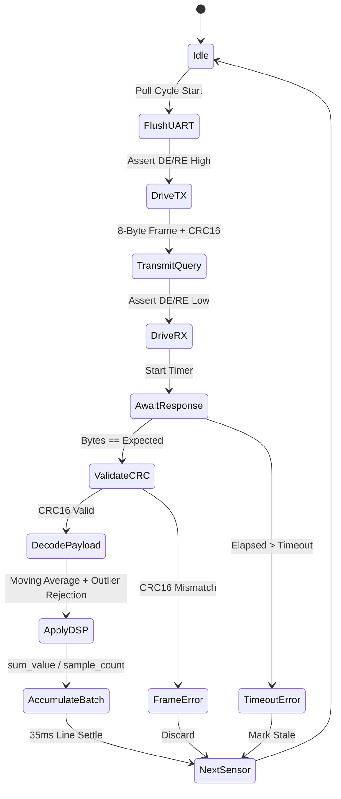
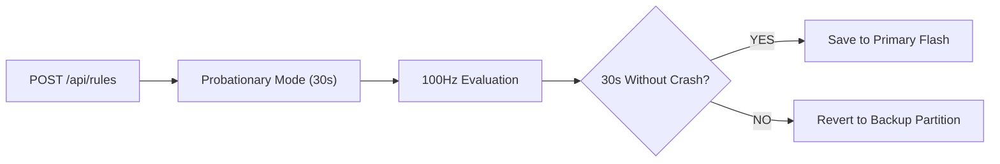

# Kontrx Universal Industrial Controller & Edge Gateway

<div align="center">

[](https://www.st.com/en/microcontrollers-microprocessors/stm32f407ve.html)
[](https://www.freertos.org/)
[](https://www.wiznet.io/product-item/w5500/)
[](https://sparkplug.eclipse.org/)
[](#industrial-interfaces-motion--analog-subsystems)
[](#executive-technical-summary)
[](LICENSE)

**An industrial-grade, multi-tasking edge gateway and universal automation controller engineered for real-time motion control (PTO/PWM), analog I/O (0-10V / 4-20mA), water quality monitoring (Modbus RTU), SD card event logging, and SCADA / Cloud IoT integration (Modbus TCP, Sparkplug B, MQTT).**

[System Architecture](#system-architecture) · [Hardware](#hardware-specifications--pinout) · [RTOS Tasks](#freertos-multi-tasking-architecture) · [Memory & Storage](#flash-memory--sd-card-architecture) · [Modbus & DSP](#modbus-rtu-sensor-subsystem--dsp-filtering) · [Motion & Analog](#industrial-interfaces-motion--analog-subsystems) · [Telemetry](#cloud-telemetry--sparkplug-b-engine) · [Rule Engine](#edge-rule-engine--fail-safe-watchdog) · [Web Dashboard](#web-dashboard--rest-api) · [OTA Updates](#ota-firmware-updates) · [Build & Flash](#build--flashing-guide)

</div>

---

## Executive Technical Summary

The **Kontrx Edge Gateway** is a universal industrial controller built on the **STM32F407VET6** (ARM Cortex-M4F with hardware single-precision FPU running at 168 MHz). It bridges field instrumentation, high-speed motion actuation, and enterprise IT/OT infrastructures:

| Capability | Details |
|---|---|
| **Field Instrumentation** | RS485 Modbus RTU sensors (pH, ORP, EC, DO, Ammonia, Ultrasonic) with DSP signal conditioning |
| **Motion & Actuation** | 4-axis PTO stepper/servo (TIM1), multi-channel PWM, 0-10V DAC, 4-20mA current loop, 11x relay outputs, Digital I/O |
| **Storage** | W25Q16 2 MB SPI NOR flash (dual-redundant configs, rules, 512 KB offline queue, 1 MB audit log) + SPI3 MicroSD |
| **Networking** | WIZnet W5500 hardwired TCP/IP, 3-socket HTTP server, Modbus TCP Server (Port 502), MQTT / Sparkplug B |
| **Web Interface** | Embedded gzipped SPA with real-time 1s polling, light/dark themes, 8-category actuator dashboard |
| **Security** | Session-token auth with brute-force lockout, URL decoding, test mode / manual override guard |
| **Reliability** | Config sanitization on boot, dual-sector flash redundancy, CCMRAM zero-init, SPI timing hardening |

```
+-------------------------------------------------------------------------------------------+
|                              KONTRX UNIVERSAL CONTROLLER v2.2                             |
|                                                                                           |
|  [RS485 Modbus RTU] ----> [Noise-Filtered Poller] --> [DSP Moving-Avg/Median] --> [Batch] |
|          |                                                                         |      |
|          v                                                                         v      |
|  [Control Engine] --> [16 Automation Rules] ----------+            [Sparkplug B / MQTT]   |
|          |                                            |                        |          |
|          +---> [4x PTO Stepper/Servo] (TIM1 + EXTI)  v                        v          |
|          +---> [Multi-Channel PWM] (Timers)    [W25Q16 NOR Flash]    [W5500 SPI Ethernet] |
|          +---> [0-10V Analog & 4-20mA DAC]     - Sanitized Configs   - 3-Socket HTTP SPA |
|          +---> [11x Relay + Digital Outputs]   - Offline Queue 512KB - REST API (Port 80) |
|          +---> [Modbus TCP Server Port 502]    - Audit Log 1008KB    - Modbus TCP Server  |
|          +---> [Modbus TCP Client (PLCs)]              |             - MQTT / SpB Engine  |
|                                                        v             - Self-Healing Guard |
|                                                [SPI3 MicroSD Card]                        |
|                                                - Timestamped Logs                         |
|                                                - File Download API                        |
+-------------------------------------------------------------------------------------------+
```

---

## System Architecture


```mermaid
graph TB
    subgraph FIELD["Field Layer & Industrial Actuators"]
        S_PH["pH Sensor (ID 1)"]
        S_ORP["ORP Sensor (ID 2)"]
        S_EC["EC Sensor (ID 3)"]
        S_DO["DO KWS-630 (ID 4)"]
        S_NH3["Ammonia Sensor (ID 5)"]
        S_US["Ultrasonic Array (ID 7)"]
        ACT_LOCAL["11x Relay + Digital Outputs"]
        ACT_PTO["4x Stepper/Servo (PTO)"]
        ACT_PWM["PWM Out (Pumps/Valves)"]
        ACT_DAC["0-10V / 4-20mA Transmitters"]
        ACT_PLC["Remote PLC (Modbus TCP Client)"]
    end

    subgraph HARDWARE["STM32F407VET6 Microcontroller"]
        subgraph MCAL["Microcontroller Abstraction Layer (MCAL)"]
            M_GPIO["gpio_stm32.c — Ports A-E, BSRR"]
            M_UART["uart_stm32.c — USART1/3/6"]
            M_SPI["spi_stm32.c — SPI1 Flash, SPI2 W5500, SPI3 SD"]
            M_TIM["timer_stm32.c — TIM1-TIM4"]
            M_EXTI["exti_stm32.c — EXTI0-7 Limit Switches"]
            M_FLASH["flash_stm32.c — Internal Flash"]
            M_RTC["rtc_stm32.c — HW RTC & Unix Epoch"]
            M_RCC["rcc_stm32.c — 168 MHz PLL"]
        end

        subgraph HAL["Hardware Abstraction Layer (HAL)"]
            H_MODBUS["modbus_dma.c — RTU Parser, DCBA Float, Auto-Scan"]
            H_MODBUS_S["modbus_tcp_server.c — Port 502 + Test Mode Guard"]
            H_PTO["pto_motion.c — 4x PTO Motion Controller"]
            H_PWM["pwm_controller.c — Multi-Channel Industrial PWM"]
            H_ANALOG["analog_010v.c / dac_420ma.c — Analog Output"]
            H_SD["sdcard.c — SPI3 MicroSD + Stream Download"]
            H_FLASH["flash_partition.c — W25Q16 Partition Manager + Config Sanitizer"]
            H_PLC["plc_control.c — Modbus TCP Client Socket 4"]
            H_DISC["interface_discovery.c — Peripheral Scanner"]
            H_W25Q["w25q16.c — 2MB SPI NOR Flash Driver"]
        end

        subgraph RTOS["FreeRTOS Kernel (CMSIS-RTOS2)"]
            T_CTRL["Task_ControlEngine — Realtime (5) — 10ms Cycle"]
            T_MQTT["Task_MQTTClient — High (4) — SpB / JSON / Guard"]
            T_MODBUS["Task_ModbusSensorPoll — Normal (3) — DSP Filter"]
            T_HTTP["Task_HTTPServer — Normal (2) — 3-Socket REST + SPA"]
            T_OTA["Task_OTAUpdate — Low (1) — CRC32 + Boot Swap"]
        end
    end

    subgraph CLOUD["Enterprise, SCADA & Web Clients"]
        BROKER["MQTT Broker / EMQX / HiveMQ"]
        BROWSER["Web Browser — Ignova SPA Dashboard"]
        SCADA["SCADA / Ignition / Node-RED — Modbus TCP"]
    end

    S_PH & S_ORP & S_EC & S_DO & S_NH3 & S_US <==>|RS485| M_UART
    M_UART ==> H_MODBUS ==> T_MODBUS
    T_MODBUS ==>|DSP Filtered| T_CTRL & T_MQTT & T_HTTP

    T_CTRL ==>|GPIO| ACT_LOCAL
    T_CTRL ==>|PTO Pulses| H_PTO ==> ACT_PTO
    T_CTRL ==>|PWM| H_PWM ==> ACT_PWM
    T_CTRL ==>|Analog| H_ANALOG ==> ACT_DAC
    T_CTRL ==>|Modbus TCP| H_PLC ==> ACT_PLC

    T_MQTT ==>|Sparkplug B| BROKER
    T_HTTP ==>|HTTP/JSON| BROWSER
    H_MODBUS_S <==>|Port 502| SCADA
```

---

## Hardware Specifications & Pinout

### Board & Core Peripherals

| Component | Specification | Interface |
|---|---|---|
| **MCU** | STM32F407VET6 (Cortex-M4F @ 168 MHz, 512 KB Flash, 128 KB SRAM + 64 KB CCM) | AHB/APB Bus |
| **Ethernet** | WIZnet W5500 Hardwired TCP/IP (8 Sockets, 32 KB Buffer) | SPI2 @ 21 MHz (PB12-PB15) |
| **RS485** | MAX485 Half-Duplex with HW Direction Control | USART3 (PB10/PB11), DE=PD3, RE#=PD2 |
| **SPI Flash** | Winbond W25Q16 (16 Mbit / 2 MB NOR Flash) | SPI1 (PB0 CS, PB3-PB5) with MISO pull-up |
| **MicroSD** | SPI SD Card for audit logs | SPI3 (PC10-PC12, PD0 CS) |
| **Debug** | USART1 Serial Console (115200 8N1) | PA9 TX, PA10 RX |
| **Relays** | 11 Channels with Optocoupler Isolation | Direct GPIO Push-Pull |
| **PTO Motion** | 4-Axis Pulse Train Output + Limit EXTI | TIM1 (PE8-PE15) |
| **Analog I/O** | 0-10V Voltage & 4-20mA Current DAC | Industrial Analog Front-End |
| **RTC** | Internal RTC with LSE Crystal (32.768 kHz) | PC14/PC15 |

### Microcontroller Pin Map

<details>
<summary>Click to expand full pin mapping table</summary>

| Pin | Function | Peripheral | Description |
|---|---|---|---|
| PA0-PA4 | Relay 6-9 | GPIO Out | Actuator outputs |
| PA6 | Status LED | GPIO Out | System heartbeat |
| PA9/PA10 | Debug UART | USART1 AF7 | Serial console 115200 8N1 |
| PA13/PA14 | SWD | Dedicated | Programming & Debug |
| PB0 | W25Q16 CS | GPIO Out | SPI NOR Flash chip select |
| PB3-PB5 | SPI1 | SPI1 AF5 | Flash SCK/MISO/MOSI (MISO pull-up) |
| PB10/PB11 | Modbus | USART3 AF7 | RS485 TX/RX |
| PB12-PB15 | W5500 | SPI2 AF5 | Ethernet CS/SCK/MISO/MOSI |
| PC0/PC2 | Relay 4-5 | GPIO Out | Actuator outputs |
| PC4 | Relay 10 | GPIO Out | Actuator output |
| PC6/PC7 | Aux Console | USART6 AF8 | Auxiliary serial |
| PC10-PC12 | SPI3 | SPI3 AF6 | SD Card SCK/MISO/MOSI |
| PC14/PC15 | RTC | Dedicated | 32.768 kHz LSE Crystal |
| PD0 | SD CS | GPIO Out | MicroSD chip select |
| PD2/PD3 | RS485 DE/RE# | GPIO Out | MAX485 direction control |
| PD8 | Relay 11 | GPIO Out | Spare actuator output |
| PD12/PD13 | PWM CH0-1 | Timer | PWM output channels |
| PD14/PD15 | 0-10V CH0-1 | DAC/Timer | Analog voltage output |
| PE0/PE1/PE3/PE7 | PTO Limits | EXTI Input | Emergency stop / limit switches |
| PE2/PE4/PE6 | Relay 1-3 | GPIO Out | Actuator outputs |
| PE8/PE9 | PTO1 DIR/PUL | GPIO/TIM1 CH1 | Stepper axis 1 |
| PE10/PE11 | PTO2 DIR/PUL | GPIO/TIM1 CH2 | Stepper axis 2 |
| PE12/PE13 | PTO3 DIR/PUL | GPIO/TIM1 CH3 | Stepper axis 3 |
| PE14/PE15 | PTO4 PUL/DIR | TIM1 CH4/GPIO | Stepper axis 4 |
| PH0/PH1 | HSE Crystal | RCC | 8 MHz high-speed oscillator |

</details>

---

## FreeRTOS Multi-Tasking Architecture

The firmware runs **FreeRTOS v10** under the CMSIS-RTOS2 abstraction. Five tasks execute concurrently:

| Task | Priority | Stack | Period | Responsibilities |
|---|---|---|---|---|
| **Task_ControlEngine** | Realtime (5) | 6,144 B | 10 ms (100 Hz) | 16 automation rules, GPIO/PTO/PWM/Modbus TCP control, OTA pause gate, offline event caching, 50 ms Modbus TCP poll throttle |
| **Task_MQTTClient** | High (4) | 8,192 B | Dynamic / CoV | MQTT session, Sparkplug B protobuf (multi-type actuators), dynamic JSON, self-healing network guard, tx_enabled / skip_offline filtering |
| **Task_ModbusSensorPoll** | Normal (3) | 4,096 B | ~275 ms | Round-robin RS485 queries, noise filtering, DSP moving average / outlier rejection |
| **Task_HTTPServer** | Normal (2) | 12,288 B | Event-driven | 3-socket concurrent HTTP, gzipped SPA streaming, REST API, SD card file download, OTA upload, session auth with lockout |
| **Task_OTAUpdate** | Low (1) | 4,096 B | Event-driven | CRC32 validation, Cortex-M4 SP check, suspends Control/Modbus/MQTT during flash write |

### Thread Synchronization

| Mutex | Purpose |
|---|---|
| **spiMutex** | Recursive mutex guarding SPI2 (W5500). Prevents HTTP/MQTT/ControlEngine SPI transaction interleaving |
| **sensorMutex** | Guards `Modbus_SensorData_t`. Control Engine reads with non-blocking `osMutexAcquire(0)` |
| **configMutex** | Guards `Gateway_Config_t`. Falls back to unsynchronized copy if lock times out |
| **rulesMutex** | Guards `RuleConfig_t` for probationary rule evaluation |
| **flashMutex** | Guards W25Q16 SPI flash operations |
| **sdMutex** | Guards SD card SPI3 operations |

### Network Self-Healing

`Ensure_W5500_Network_Alive` actively verifies W5500 link status and register integrity. On link flap or register corruption, it re-initializes the network stack (default IP: `192.168.1.200`) without resetting the RTOS kernel.

---

## Flash Memory & SD Card Architecture

### Internal Flash Layout (STM32F407 — 512 KB)

```
0x08000000 +------------------------------------------------------------+
           | Sector 0 (16 KB)  : Stage-1 Bootloader (Bootloader.bin)     |
0x08004000 +------------------------------------------------------------+
           | Sector 1 (16 KB)  : OTA Metadata (Magic 0xC01D0001)         |
0x08008000 +------------------------------------------------------------+
           | Sectors 2-5 (224 KB): Active Application (KontrxRTOS.bin)   |
0x08040000 +------------------------------------------------------------+
           | Sectors 6-7 (256 KB): Firmware Staging Buffer (OTA)         |
0x08080000 +------------------------------------------------------------+
```

### External SPI NOR Flash (Winbond W25Q16 — 2 MB)

```
0x00000000 +------------------------------------------------------------+
           | Partition 0: Web Assets (512 KB) — Sectors 0-127            |
           | Gzipped HTML5/CSS3/JS SPA (41 KB compressed)                |
0x00080000 +------------------------------------------------------------+
           | Partition 1: Configuration & Rules (16 KB)                  |
           |   0x080000 (Sec 128): Primary Gateway Config                |
           |   0x081000 (Sec 129): Backup Gateway Config                 |
           |   0x082000 (Sec 130): Primary Automation Rules              |
           |   0x083000 (Sec 131): Backup Stable Rules                   |
0x00084000 +------------------------------------------------------------+
           | Partition 2: Offline Telemetry Queue (512 KB)               |
           | Sectors 132-259: 32,768 slots x 16-byte FIFO ring buffer    |
0x00104000 +------------------------------------------------------------+
           | Partition 3: Persistent Audit Logs (1,008 KB)               |
           | Sectors 260-511: Circular wrap-around event logger          |
0x00200000 +------------------------------------------------------------+
```

### Configuration Dual-Sector Redundancy

On boot, `Partition_LoadConfig` attempts recovery in order:

1. **Primary sector** — CRC32 + magic validation
2. **Backup sector** — fallback if primary corrupted
3. **Magic-only migration** — CRC-skip recovery for firmware upgrades
4. **Config sanitization** — bounds-checks all fields, null-terminates strings, validates MQTT topic characters, resets out-of-range values, and re-saves if any corrections were made

### CCM RAM (64 KB Fast SRAM)

The `.ccmram` section in `app_ota.ld` is zero-initialized at startup via `Reset_Handler`. Used for:
- `g_mqtt_status` — volatile MQTT state (avoids main SRAM pressure)
- `tx_buf[32768]` — HTTP response buffer (32 KB)
- `clean_payload[2560]` — MQTT log payload scrubbing buffer

### MicroSD Card Storage

- **Interface**: SPI3 Master (PC10 SCK, PC11 MISO, PC12 MOSI, PD0 CS)
- **Streaming download**: `SDCard_Stream_Download` sends file contents directly over a W5500 socket with chunked transfer, avoiding RAM buffering
- **Boot audit log**: Detailed hardware initialization sequence embedded in firmware
- **REST export**: `/api/sdcard/download?file=<name>` endpoint with `Content-Disposition` headers

---

## Modbus RTU Sensor Subsystem & DSP Filtering

Field sensors connect over RS485 at 9600 baud (8N1) via the MAX485 transceiver:


```mermaid
stateDiagram-v2
    [*] --> Idle
    Idle --> FlushUART: Poll Cycle Start
    FlushUART --> DriveTX: Assert DE/RE High
    DriveTX --> TransmitQuery: 8-Byte Frame + CRC16
    TransmitQuery --> DriveRX: Assert DE/RE Low
    DriveRX --> AwaitResponse: Start Timer
    AwaitResponse --> ValidateCRC: Bytes == Expected
    AwaitResponse --> TimeoutError: Elapsed > Timeout
    ValidateCRC --> DecodePayload: CRC16 Valid
    ValidateCRC --> FrameError: CRC16 Mismatch
    DecodePayload --> ApplyDSP: Moving Average + Outlier Rejection
    ApplyDSP --> AccumulateBatch: sum_value / sample_count
    AccumulateBatch --> NextSensor: 35ms Line Settle
    TimeoutError --> NextSensor: Mark Stale
    FrameError --> NextSensor: Discard
    NextSensor --> Idle
```

### Sensor Type Reference

| Type | Sensor | Register | Format | Timeout |
|---|---|---|---|---|
| 1 | pH Sensor | 0x0000 (2 regs) | 16-bit Int, /100 | 40 ms |
| 2 | ORP Sensor | 0x0000 (2 regs) | 16-bit Int, mV | 40 ms |
| 3 | EC Sensor | 0x0000 (2 regs) | 16-bit Int, /10 uS/cm | 40 ms |
| 4 | DO (KWS-630) | 0x2600 (6 regs) | IEEE-754 DCBA Float | 150 ms |
| 5 | Ammonia | 0x0000 (2 regs) | 16-bit Int, mg/L | 40 ms |
| 6 | Single Ultrasonic | 0x0000 (10 regs) | 16-bit Int, /10 mm | 40 ms |
| 7 | Multi-US Array | ch*0x10 (3 regs) | 8 channels round-robin | 40 ms |

### DSP Signal Conditioning (`dsp_filter.c`)

- **Windowed Moving Average**: Smooths high-frequency noise from electrical and acoustic sources
- **Median Filtering**: Eliminates transient spikes from relay-switching EMI
- **Outlier Rejection**: Rejects readings exceeding realistic physical rates of change

---

## Industrial Interfaces: Motion & Analog Subsystems

### Actuator Type System

Kontrx v2.2 supports **8 actuator types**, each with dedicated control logic in the Control Engine, HTTP API, and Sparkplug B telemetry:

| Type ID | Name | Control Method | Status Telemetry |
|---|---|---|---|
| 0 | **Local GPIO** | Direct pin toggle (NO/NC configurable) | Boolean ON/OFF |
| 1 | **Modbus TCP** | FC5 Write Single Coil over Socket 4 | Boolean ON/OFF |
| 2 | **OPC UA** | Node ID write (placeholder) | Boolean ON/OFF |
| 3 | **PWM** | Duty cycle 0-100% via hardware timer | Float duty_pct |
| 4 | **PTO Motion** | Step count + frequency via TIM1 | Position, frequency, moving flag |
| 5 | **4-20mA** | Current loop DAC output | Float mA |
| 6 | **0-10V** | Voltage DAC output | Float V |
| 7 | **Digital Output** | General-purpose digital pin toggle | Boolean ON/OFF |

### PTO Motion Control (`pto_motion.c`)

- **4 Independent Channels**: TIM1 advanced timer (PE9, PE11, PE13, PE14)
- **Direction Outputs**: Dedicated GPIOs (PE8, PE10, PE12, PE15)
- **Hardware Limit Switches**: EXTI lines on PE0, PE1, PE3, PE7 for zero-latency motion halt
- **Features**: Acceleration/deceleration ramps, target pulse counting, continuous velocity mode, homing, position tracking

### PWM Control (`pwm_controller.c`)

- Configurable frequency and duty cycle (0.0%-100.0%)
- Real-time pin name reporting in API (e.g., PD12, PD13)

### Analog Output

- **0-10V** (`analog_010v.c`): Industrial voltage output for VFDs and motorized dampers
- **4-20mA** (`dac_420ma.c`): High-precision current loop transmitter with fault detection

### Modbus TCP Server (`modbus_tcp_server.c`)

- Listens on **Port 502** for SCADA systems (Ignition, Wonderware, Node-RED)
- **Test Mode Guard**: Holding register writes and coil writes are blocked unless `test_mode == 1` in the gateway configuration, preventing accidental actuator commands from SCADA during automated rule operation
- Function codes: FC3 (Read Holding Registers), FC5 (Write Single Coil), FC6 (Write Single Register), FC16 (Write Multiple Registers)

---

## Cloud Telemetry & Sparkplug B Engine

The gateway natively serializes telemetry using the **Eclipse Sparkplug B** specification in binary protobuf format without dynamic heap allocation.

### Sparkplug B Message Types

| Message | Published When | Content |
|---|---|---|
| **NBIRTH** | On broker connect | Gateway identity, firmware version, full sensor inventory, all actuator metadata (type-specific: duty%, position, current, voltage) |
| **DDATA** | Periodic / CoV | Sensor averages, actuator states with online/offline quality flags, system status |
| **NDEATH** | MQTT LWT | Last Will and Testament on `spBv1.0/<group>/NDEATH/<node>` |

### Multi-Type Actuator Telemetry

Sparkplug B DDATA now emits type-aware metrics for each actuator:

- **GPIO / Digital Output**: `Actuators/<name>` as boolean
- **PWM**: `Actuators/<name>` as float (duty %)
- **PTO**: `Actuators/<name>` (position), `<name>/Frequency`, `<name>/Steps`, `<name>/Moving`
- **4-20mA**: `Actuators/<name>` as float (mA)
- **0-10V**: `Actuators/<name>` as float (V)

### MQTT Configuration Options

| Field | Description |
|---|---|
| `mqtt_tx_enabled` | 0 = publishing paused, 1 = active |
| `mqtt_skip_offline` | 1 = omit offline/zero sensors from MQTT messages |
| `mqtt_send_mode` | 0 = periodic interval, 1 = change-of-value |
| `mqtt_interval` | Publish interval in seconds (1-86400) |
| `mqtt_payload_shape` | 0 = Sparkplug B, 1 = flat JSON, 2 = nested JSON |

### Offline Telemetry Queue

If the MQTT broker is unreachable:
- Telemetry and relay state-change events are diverted to the **512 KB SPI Flash FIFO queue**
- Up to **32,768 records** buffered with uptime timestamps
- Queue is flushed in chronological order when connectivity is restored
- Relay state changes are cached to the offline queue when the broker is disconnected

---

## Edge Rule Engine & Fail-Safe Watchdog

The Control Engine evaluates up to **16 user-defined automation rules** every 10 ms (100 Hz):

```
Rule Definition:
IF [input_id: "ph"] [operator: "<"] [threshold: 6.5]
THEN SET [output_id: "Relay_1"] TO [action: "ON"]
```

### Rule Input Resolution

The engine resolves input identifiers against:
1. Sensor readings by type name (e.g., `ph`, `ec`, `do`, `orp`)
2. Sensor ID prefix (e.g., `sensor_1`)
3. System values (`uptime`, `cpu`)

### Rule Output Resolution

Output ID matching follows a precedence chain:
1. Exact actuator name match
2. `(ID X)` or `ID X` extraction
3. `relay_X` / `relayX` / `Relay X` patterns
4. First digit extraction as fallback

### Test Mode

When `test_mode == 1`:
- Modbus TCP Server allows external writes (SCADA / PLC commands accepted)
- Rules continue to evaluate but manual override takes precedence

When `test_mode == 0` (default):
- Modbus TCP Server rejects write commands (FC5, FC6, FC16)
- Only the rule engine and web dashboard can control actuators

### Rule Persistence (Probationary System)


```mermaid
graph LR
    SUBMIT["POST /api/rules"] --> PROBATION["Probationary Mode (30s)"]
    PROBATION --> EVAL["100Hz Evaluation"]
    EVAL --> STABLE{"30s Without Crash?"}
    STABLE -- YES --> COMMIT["Save to Primary Flash"]
    STABLE -- NO --> ROLLBACK["Revert to Backup Partition"]
```

---

## Web Dashboard & REST API

### Embedded SPA Architecture

The web interface is a single-page application stored as **gzipped HTML/CSS/JS** (41 KB compressed) in the W25Q16 web asset partition. Key features:

- **Real-time 1-second polling** via `fetch('/api/status')`
- **Light / Dark theme** with CSS custom properties
- **8-category actuator dashboard**: GPIO Relays, Digital Outputs, Modbus TCP, OPC UA, PWM, PTO Motion, 4-20mA, 0-10V
- **Tile / Card view toggle** for actuator display
- **SVG vector iconography** matching Kontrx branding
- **Infinite scroll** log viewer with pagination
- **Dynamic QR code** generator for device identification

### HTTP Server

- **3 concurrent sockets** (sockets 0, 3, 6) for parallel request handling
- **32 KB response buffer** in CCM RAM for large JSON payloads
- **4 KB request buffer** to accommodate large POST payloads (e.g., 16-actuator config JSON ~3.3 KB)
- **Chunked transfer** with 1 KB segments to avoid W5500 TX buffer stalls
- **Gzip Content-Encoding** for SPA delivery

### Authentication & Security

- **Session tokens**: 128-bit pseudo-random tokens using DWT cycle counter + tick count entropy
- **Brute-force protection**: 5 failed login attempts trigger a 30-second lockout
- **URL decoding**: Proper `%XX` and `+` decoding for query parameters
- **Credentials**: Configurable admin username/password stored in flash config

### Key REST API Endpoints

| Method | Endpoint | Description |
|---|---|---|
| GET | `/api/status` | Full system status JSON (sensors, actuators, MQTT, system info, rules) |
| GET | `/api/hardware` | Hardware inventory with pin assignments and actuator types |
| POST | `/api/config` | Update gateway configuration (MQTT, sensors, actuators, credentials) |
| POST | `/api/rules` | Upload automation rules (enters 30s probation) |
| POST | `/api/relay?idx=N&state=0\|1` | Toggle relay/actuator by index |
| POST | `/api/pwm?ch=N&duty=X` | Set PWM duty cycle |
| POST | `/api/pto` | PTO motion command (move, home, stop) |
| POST | `/api/420ma?ch=N&ma=X` | Set 4-20mA output |
| POST | `/api/010v?ch=N&v=X` | Set 0-10V output |
| GET | `/api/logs?offset=N&limit=N` | Paginated audit log |
| GET | `/api/sdcard/list` | SD card file directory listing |
| GET | `/api/sdcard/read?file=X` | Read SD card file (paged) |
| GET | `/api/sdcard/download?file=X` | Stream file download with Content-Disposition |
| GET | `/api/interfaces` | Hardware interface discovery JSON |
| POST | `/api/interface/toggle?id=N` | Enable/disable interface (W5500 and ASIC protected) |
| POST | `/api/ota/upload` | OTA firmware upload with OTP validation |
| POST | `/api/login` | Authenticate and receive session token |

---

## OTA Firmware Updates

### Process

1. User uploads `KontrxRTOS.bin` via the web dashboard OTA panel
2. Firmware is written to the staging flash area (Sectors 6-7, 256 KB)
3. **Task_OTAUpdate** validates:
   - CRC32 checksum of staged firmware
   - ARM Cortex-M4 stack pointer value at offset 0
4. On validation success:
   - **Suspends** Control Engine, Modbus, and MQTT tasks to prevent SPI contention
   - Writes bootloader metadata to Sector 1
   - Triggers system reset
5. Bootloader copies staging firmware to application area and boots

### Safety Features

- `g_ota_in_progress` flag causes Control Engine to yield (50 ms delay loop)
- All three worker tasks (Control, Modbus, MQTT) are suspended during flash write
- Failed validation resumes all tasks and logs the error
- OTP secret (`KontrxOTA2026`) prevents unauthorized uploads

---

## Interface Discovery

The `interface_discovery.c` module provides a dynamic peripheral capability scanner reporting all 11 hardware interfaces:

| ID | Interface | Protection |
|---|---|---|
| 0 | Industrial Ethernet (W5500) | Cannot be disabled |
| 1-9 | RS485, Relays, PTO, PWM, etc. | User-toggleable |
| 10+ | ASIC slots | Cannot be disabled (`waiting_asic` status) |

The JSON response includes a `can_disable` flag so the web UI can grey out protected interfaces.

---

## Build & Flashing Guide

### Prerequisites

- **CMake** v3.10+
- **GNU Arm Embedded Toolchain** (`arm-none-eabi-gcc` v10.3+)
- **Ninja** or **Make**
- **ST-Link v2/v3** or **J-Link** programmer

### Compile

```bash
cmake -B build -DCMAKE_TOOLCHAIN_FILE=arm_toolchain.cmake -G Ninja
cmake --build build
```

Build artifacts in `build/`:
- `Bootloader.bin` — Stage-1 Bootloader (0x08000000)
- `KontrxRTOS.bin` / `KontrxRTOS.hex` — Production RTOS Application (0x08008000)
- `RS485_Diag.bin` — Standalone RS485 diagnostic tool

> The CMake build system automatically discovers `arm-none-eabi-objcopy` and `arm-none-eabi-size` from the toolchain path, making it portable across different installation directories.

### Flash via ST-Link / OpenOCD

```bash
# Bootloader (Sector 0)
openocd -f interface/stlink.cfg -f target/stm32f4x.cfg \
  -c "program build/Bootloader.bin 0x08000000 verify reset exit"

# Application (Sector 2+)
openocd -f interface/stlink.cfg -f target/stm32f4x.cfg \
  -c "program build/KontrxRTOS.bin 0x08008000 verify reset exit"
```

### OTA Field Update

1. Open `http://192.168.1.200`
2. Navigate to **OTA Firmware Update**
3. Enter OTP: `KontrxOTA2026`
4. Upload `KontrxRTOS.bin`
5. Device validates CRC32, writes to staging flash, and reboots into the new firmware

---

## Project Structure

| Path | Description |
|---|---|
| `APP/main_kontrx.c` | Master entry point; MCAL init, W5500, partitions, RTOS scheduler |
| `APP/freertos_tasks.c` | RTOS tasks, rule engine, relay control, MQTT client, network guard |
| `APP/http_server_task.c` | 3-socket HTTP server, REST API, SPA streaming, OTA upload |
| `APP/sparkplug_b_enc.c` | Zero-heap Sparkplug B protobuf encoder (NBIRTH, DDATA, NDEATH) |
| `APP/ota_task.c` | Background OTA validation with CRC32 and task suspension |
| `APP/dsp_filter.c` | Moving average, median filter, outlier rejection |
| `APP/bootloader.c` | Stage-1 bootloader at 0x08000000 |
| `APP/web_assets.h` | Gzipped embedded SPA (auto-generated) |
| `HAL/modbus_dma.c` | Modbus RTU poller, DCBA float, auto-scan, config storage |
| `HAL/modbus_dma.h` | Gateway config struct, actuator types, sensor types |
| `HAL/modbus_tcp_server.c` | Modbus TCP Server (Port 502) with test mode guard |
| `HAL/flash_partition.c` | W25Q16 partition manager with config sanitizer |
| `HAL/sdcard.c` | MicroSD card driver with stream download API |
| `HAL/interface_discovery.c` | Dynamic hardware interface scanner |
| `HAL/pto_motion.c` | 4-channel PTO stepper/servo controller |
| `HAL/pwm_controller.c` | Multi-channel industrial PWM |
| `HAL/analog_010v.c` | 0-10V industrial analog output |
| `HAL/dac_420ma.c` | 4-20mA current loop DAC |
| `HAL/w25q16.c` | W25Q16 SPI NOR flash driver with CS timing |
| `HAL/plc_control.c` | Modbus TCP Client for remote PLCs |
| `MCAL/STM32F4/` | Bare-metal register drivers (GPIO, UART, SPI, TIM, EXTI, RTC, RCC, Flash) |
| `FreeRTOS/` | FreeRTOS v10 kernel sources |
| `startup_stm32f407xx.c` | Reset handler, vector table, CCMRAM zero-init |
| `CMakeLists.txt` | Build system with portable toolchain discovery |
| `app_ota.ld` | OTA application linker script (CCMRAM section) |

---

## Release History

### v2.2.0 — Multi-Type Actuator Engine, Config Robustness & Security Hardening

**Actuator Engine Expansion**
- Added `ACTUATOR_TYPE_DIGITAL_OUT` (type 7) for general-purpose digital outputs
- Sparkplug B encoder emits type-aware metrics (PWM duty%, PTO position/frequency/moving, 4-20mA current, 0-10V voltage)
- HTTP API returns real hardware pin names for all actuator types (PTO PUL/DIR pins, PWM pin, DAC pin)
- Rule engine output resolver handles `(ID X)`, `relay_X`, `Relay X`, and `ID_X` patterns

**HTTP Server & Web UI**
- 3-socket concurrent HTTP server (sockets 0, 3, 6) for parallel request handling
- Gzipped SPA delivery (41 KB compressed)
- 32 KB response buffer in CCM RAM for large status JSON payloads
- 4 KB request buffer for large POST payloads
- URL-decoded query parameters
- Session token entropy improved (DWT cycle counter + 4-word hash)
- Brute-force login lockout (5 attempts / 30s cooldown)
- SD card file streaming download endpoint

**Configuration & Reliability**
- Boot-time config sanitization: bounds-checks, null-termination, topic validation, default restoration
- Dual-sector config load with magic-only migration fallback for firmware upgrades
- Added `test_mode`, `mqtt_tx_enabled`, `mqtt_skip_offline` configuration fields
- Modbus TCP Server write commands blocked unless test mode is active

**OTA Safety**
- Control Engine task suspended during OTA flash write (in addition to Modbus/MQTT)
- `g_ota_in_progress` flag pauses control engine loop
- CCMRAM section properly zero-initialized at startup

**Hardware Reliability**
- SPI1 MISO (PB4) pull-up resistor enabled for reliable W25Q16 reads
- W25Q16 CS timing delays (20-cycle assert, 40-cycle deassert) for signal integrity
- CMake build uses portable toolchain path discovery

**Offline Telemetry**
- Relay state-change events cached to offline queue when MQTT broker is disconnected
- SD card queue streaming with detailed partition metadata
- Boot audit log with hardware initialization sequence

**Cleanup**
- Removed deprecated Python test scripts (control_relays.py, decode_sparkplug.py, test_float_decode.py, test_sparkplug_and_mqtt.py)
- Firmware version bumped from 2.0.0 to 2.2.0
- Interface discovery includes `can_disable` flag; W5500 and ASIC interfaces protected from disable

### v2.1.0 — 7-Category Actuator UI & OTA Reliability

- 7-category actuator dashboard (GPIO, Modbus TCP, OPC UA, PWM, PTO, 4-20mA, 0-10V)
- Category header actions (All ON/OFF, All 50%, STOP ALL, Zero All)
- OTA trailing garbage fix (strlen vs sizeof for web asset streaming)
- SVG iconography refresh
- Flash footprint kept under 224 KB staging boundary

### v2.0.0 — Initial Release

- FreeRTOS v10 multi-tasking with 5 concurrent tasks
- Modbus RTU sensor polling with DSP filtering
- 4-axis PTO motion control with limit switches
- Sparkplug B / MQTT telemetry engine
- Embedded responsive SPA dashboard
- W25Q16 dual-redundant configuration and offline telemetry queue
- OTA firmware update with CRC32 validation and bootloader
- Modbus TCP Server on Port 502
- Edge rule engine with probationary persistence

---

## License

This project is licensed under the MIT License — see the [LICENSE](LICENSE) file for details.
