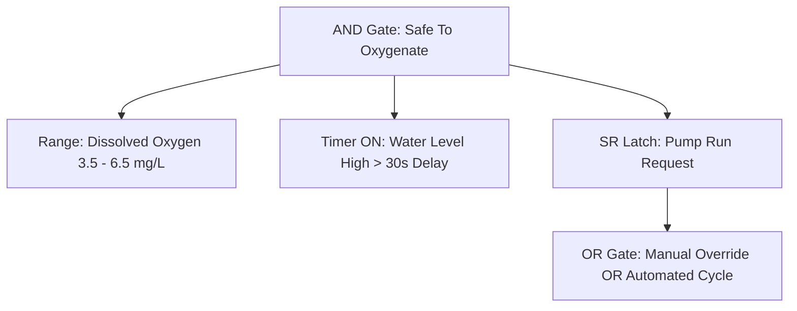

# 03 - KONTRX Autonomous Hierarchical Rule Engine & Sequences (v2.3)

## 1. Why the Edge Rule Engine Was Built
In industrial aquaculture, chemical manufacturing, and remote water pumping stations, connectivity to cloud platforms cannot be guaranteed 100% of the time. 
* A dropped 4G/LTE connection or AWS outage must **never** result in aerator failure, pump cavitation, or tank overflow.
* Latency-sensitive emergency shutoffs require sub-millisecond reactions that internet round-trips cannot deliver.
* The KONTRX Rule Engine executes autonomously directly on the STM32F407 core every 100 ms, completely decoupled from internet availability.

---

## 2. Hierarchical Condition Tree Structure (`CondNode_t`)
Prior versions supported only flat, single-comparison rules (`if sensor > threshold then relay on`). Version 2.3 introduces arbitrary boolean expressions and stateful nodes:

### Supported Condition Types:
1. **Simple Comparison**: `>`, `<`, `==`, `!=`, `>=`, `<=` against constant or secondary sensor (`compare_mode`).
2. **Range Condition**: Asserts whether a value is `INSIDE` or `OUTSIDE` a `[min, max]` window.
3. **Hysteresis Condition**: Eliminates relay chattering near threshold boundaries using separate turn-on (`high_threshold`) and turn-off (`low_threshold`) levels.
4. **Logic Gates (AND, OR, NOT)**: Supports up to 4 child nodes per gate, enabling complex multi-sensor dependencies.
5. **TON (Timer On-Delay)**: Condition must remain continuously TRUE for `delay_ms` before triggering the output, filtering out brief transient spikes.
6. **TP (Pulse Timer)**: On a rising edge input, produces an active pulse of fixed duration `delay_ms` regardless of input stability.
7. **Bistable SR Latch**: Retains state with configurable Set-dominant or Reset-dominant priority.

---

## 3. Multi-Step Action Sequences (`ActionSequence_t`)
Instead of static instantaneous states, rules can trigger multi-stage automated workflows:
* **Modes**:
  * `SEQ_MODE_ONCE`: Run steps sequentially to completion once.
  * `SEQ_MODE_LOOP`: Continuously cycle through sequence steps while condition holds.
  * `SEQ_MODE_COUNT`: Repeat sequence for a specified count $N$.
* **Fail-Safe On-False Behavior**:
  * `SEQ_ON_FALSE_ABORT_SAFE`: Immediately aborts sequence and commands actuator to safe zero/off state.
  * `SEQ_ON_FALSE_FINISH_CYCLE`: Allows the current active cycle to complete before disabling.
  * `SEQ_ON_FALSE_HOLD`: Freezes the actuator in its last held position/value.

---

## 4. Canvas Layout Persistence & Version Rollback
1. **16 KB Layout Partition**: Stores the exact JSON canvas graph from the Desktop Configurator, allowing lossless visual round-trip editing.
2. **12-Slot Archive History**: Whenever a new ruleset is deployed, the prior working configuration is automatically committed into a flash history slot.
3. **One-Click Rollback**: Via `/api/rules/rollback?version=<id>`, the controller instantly restores any historical ruleset without firmware reflash.
