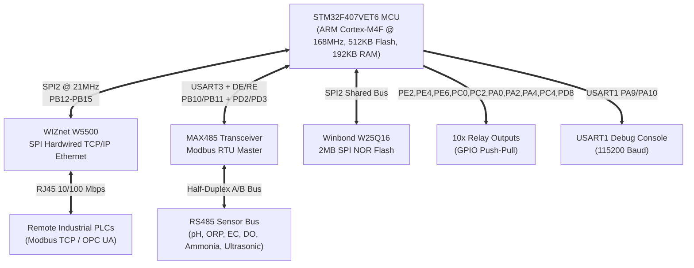
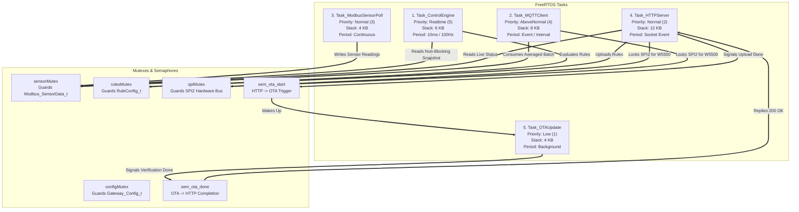
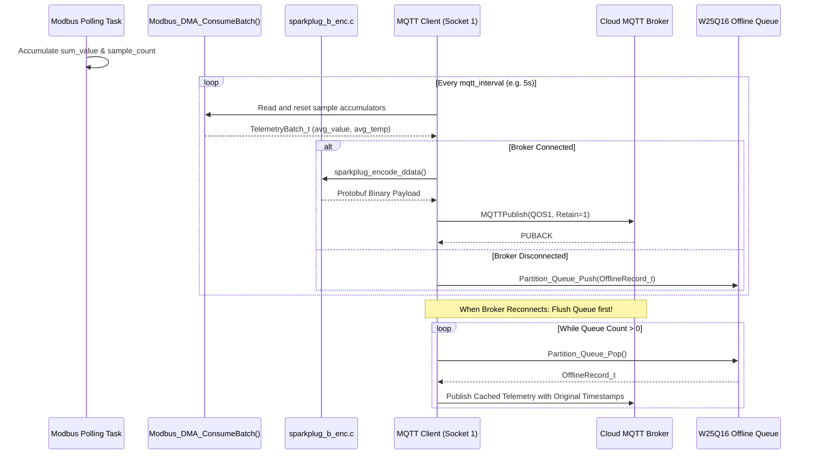
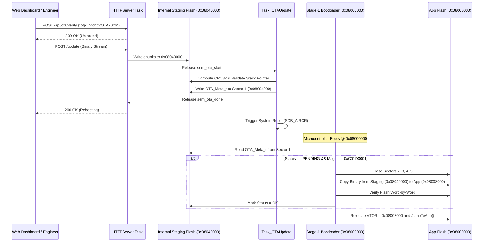

# Kontrx System Architecture & Technical Manual

The **Kontrx Edge Gateway** is an industrial-grade embedded gateway and distributed automation controller designed for real-time water quality monitoring, edge automation, and cloud SCADA integration.

---

## 1. Hardware Architecture



---

## 2. Flash Memory Architecture & Partitioning

### 2.1 Internal STM32F407 Flash Layout (512 KB Total)

| Sector | Base Address | Size | Description |
|---|---|---|---|
| **Sector 0** | `0x08000000` | 16 KB | Stage-1 Bootloader (`Bootloader.bin`) |
| **Sector 1** | `0x08004000` | 16 KB | OTA Metadata (`OTA_Meta_t`, Magic: `0xC01D0001`) |
| **Sectors 2–5** | `0x08008000` | 224 KB | Active Production Application (`KontrxRTOS.bin`) |
| **Sectors 6–7** | `0x08040000` | 256 KB | Firmware Staging Buffer (Receives OTA uploads) |
| **Sector 7 Tail** | `0x0807C000` | 16 KB | Internal Flash Configuration Backup (`CONFIG_FLASH_ADDR`) |

---

### 2.2 External Winbond W25Q16 SPI Flash Layout (2 MB Total)

```
0x00000000 ┌────────────────────────────────────────────────────────┐
           │ Partition 0: Web Assets (512 KB)                       │
           │ (Sectors 0–127: Embedded HTML5 / CSS3 / JS Dashboard)   │
0x00080000 ├────────────────────────────────────────────────────────┤
           │ Partition 1: Redundant System Configuration (16 KB)    │
           │   - Sector 128 (0x080000): Primary Config              │
           │   - Sector 129 (0x081000): Backup Config               │
           │   - Sector 130 (0x082000): Primary Rules (v1.0.x)      │
           │   - Sector 131 (0x083000): Backup Rules (Stable)       │
0x00084000 ├────────────────────────────────────────────────────────┤
           │ Partition 2: Offline Telemetry Queue (512 KB)          │
           │ (Sectors 132–259: 32,768 Slots × 16-byte FIFO Ring)    │
0x00104000 ├────────────────────────────────────────────────────────┤
           │ Partition 3: Persistent Audit Logs (1008 KB)           │
           │ (Sectors 260–511: Wrap-around Circular Event Logger)   │
0x00200000 └────────────────────────────────────────────────────────┘
```

---

## 3. FreeRTOS Task Architecture & IPC

The gateway runs 5 specialized tasks mapped to CMSIS-RTOS2 API priorities:



---

## 4. RS485 Modbus RTU Sensor Subsystem

### 4.1 Supported Sensors & Mathematical Decoding

| Type ID | Sensor Name | Modbus Function | Start Register | Count | Raw Bytes / Format | Output Formula | Default Timeout |
|---|---|---|---|---|---|---|---|
| **1** | pH Sensor | `0x03` (Read Holding) | `0x0000` | 2 | 2x 16-bit Int | `value = reg[0]/100.0`, `temp = reg[1]/100.0` | 40 ms |
| **2** | ORP Sensor | `0x03` (Read Holding) | `0x0000` | 2 | 2x 16-bit Int | `value = (float)reg[0]`, `temp = reg[1]/100.0` | 40 ms |
| **3** | EC Sensor | `0x03` (Read Holding) | `0x0000` | 2 | 2x 16-bit Int | `value = reg[0]/10.0`, `temp = reg[1]/100.0` | 40 ms |
| **4** | DO (KWS-630) | `0x03` (Read Holding) | `0x2600` | 6 | IEEE-754 DCBA Float | `temp = DecodeFloat_DCBA(reg[0..1])`<br/>`value = DecodeFloat_DCBA(reg[4..5])` | 150 ms |
| **5** | Ammonia Sensor | `0x03` (Read Holding) | `0x0000` | 2 | 2x 16-bit Int | `value = (float)reg[0]`, `temp = reg[1]/100.0` | 40 ms |
| **6** | Single Ultrasonic | `0x03` (Read Holding) | `0x0000` | 10 | 10x 16-bit Int | `temp = reg[8]/10.0`, `value = reg[9]/10.0` | 40 ms |
| **7** | Multi-Point US (8 Ch) | `0x03` / `0x04` | `ch*0x10` | 3 | 3x 16-bit Int | `dist[ch] = (float)reg[0]` (2 channels/cycle) | 40 ms |

---

### 4.2 IEEE-754 Little-Endian (DCBA) Float Decoding

The **KWS-630 Dissolved Oxygen Sensor** encodes floating point values in **DCBA** byte order across two 16-bit Modbus registers:
```c
static float Decode_Float_DCBA(uint16_t r0, uint16_t r1) {
    union { float f; uint8_t b[4]; } u;
    u.b[0] = (uint8_t)(r0 >> 8);    /* D = LSB */
    u.b[1] = (uint8_t)(r0 & 0xFF);  /* C */
    u.b[2] = (uint8_t)(r1 >> 8);    /* B */
    u.b[3] = (uint8_t)(r1 & 0xFF);  /* A = MSB */
    return u.f;
}
```

---

## 5. Telemetry & Sparkplug B / MQTT Engine



---

## 6. Over-The-Air (OTA) Dual-Stage Bootloader Flow


