# System Architecture Topology

## 1. High-Level Edge Topology
The diagram below illustrates the end-to-end operational architecture of KONTRX, spanning physical field devices, the STM32F407 core controller, local network interfaces, and supervisory SCADA platforms.

```mermaid
graph TD
    subgraph FieldLevel ["Physical Field Devices & Sensors"]
        S1["pH Sensor (Modbus RTU)"]
        S2["EC Conductivity (Modbus RTU)"]
        S3["DO Dissolved Oxygen (DCBA Float)"]
        S4["Ammonia / Water Level"]
        A1["Inductive Pumps / Relays (GPIO)"]
        A2["Aerator VFD Speed (PWM / 0-10V)"]
        A3["Dosing Pumps (4-20mA Current)"]
        A4["Feeder Actuator (4-Axis PTO)"]
    end

    subgraph HardwareController ["KONTRX Industrial Controller (STM32F407VET6)"]
        subgraph HardwareLayers ["Hardware Interfaces"]
            MAX485["MAX485 (USART3 DMA)"]
            SPI_ETH["W5500 SPI2 Ethernet @ 21MHz"]
            SPI_FL["Winbond W25Q16 (SPI1 Flash)"]
            SD_SLOT["MicroSD FAT32 (SPI/SDIO)"]
            TIM_MOD["Timers (TIM1 PTO / TIM4 PWM)"]
            DAC_MOD["DAC MCP4922 (SPI3 4-20mA)"]
        end

        subgraph FreeRTOS_Core ["FreeRTOS Kernel & Tasks"]
            T_MODBUS["Task_ModbusSensorPoll (275ms)"]
            T_CTRL["Task_ControlEngine (100ms)"]
            T_MQTT["Task_MQTTClient (1000ms)"]
            T_HTTP["Task_HTTPServer (Port 80)"]
            T_TCP["Task_ModbusTCPServer (Port 502)"]
            T_OTA["Task_OTAUpdate (Low Priority)"]
        end

        subgraph StoragePartitions ["Internal & External Storage"]
            CCM["64KB CCMRAM (Buffers & ISR)"]
            SRAM["112KB SRAM1 (RTOS Heap & Data)"]
            W25Q["2MB NOR Flash (Config & Layout)"]
            INT_FLASH["512KB STM32 Flash (Boot + App + OTA)"]
        end
    end

    subgraph ClientScada ["Clients & Supervisory Systems"]
        SPA["Local Browser (Embedded SPA Dashboard)"]
        DESK["Rule Configurator Desktop App"]
        BROKER["MQTT Broker (EMQX / Mosquitto)"]
        IGN["Ignition SCADA / Sparkplug B Host"]
    end

    %% Sensor Connections
    S1 -->|RS485 Bus 1| MAX485
    S2 -->|RS485 Bus 1| MAX485
    S3 -->|RS485 Bus 1| MAX485
    S4 -->|RS485 Bus 1| MAX485

    MAX485 --> T_MODBUS
    T_MODBUS -->|Mutex-Guarded Cache| T_CTRL
    T_MODBUS -->|Telemetry Stream| T_MQTT
    T_MODBUS -->|Status API| T_HTTP

    %% Actuator Connections
    T_CTRL --> TIM_MOD
    T_CTRL --> DAC_MOD
    TIM_MOD --> A2
    TIM_MOD --> A4
    DAC_MOD --> A3
    T_CTRL --> A1

    %% Network & Storage Connections
    T_MQTT <--> SPI_ETH
    T_HTTP <--> SPI_ETH
    T_TCP <--> SPI_ETH

    SPI_ETH <--> BROKER
    BROKER <--> IGN
    SPI_ETH <--> SPA
    SPI_ETH <--> DESK

    T_CTRL <--> W25Q
    T_HTTP <--> W25Q
    T_MQTT <--> SD_SLOT
```

---

## 2. Bus Isolation & Hardware Domain Boundaries
1. **Fieldbus Domain (RS485)**: Galvanically isolated differential RS485 bus with 120-ohm termination, transient voltage suppressor (TVS) diodes, and optical isolation.
2. **Ethernet Domain (IEEE 802.3)**: 10/100 Mbps RJ45 with integrated magnetics providing 1.5 kV isolation against common-mode electrical noise.
3. **Power & Actuator Domain**: Optocoupled transistor drivers isolating 3.3V logic from 24V DC / 220V AC industrial coil contactors.
