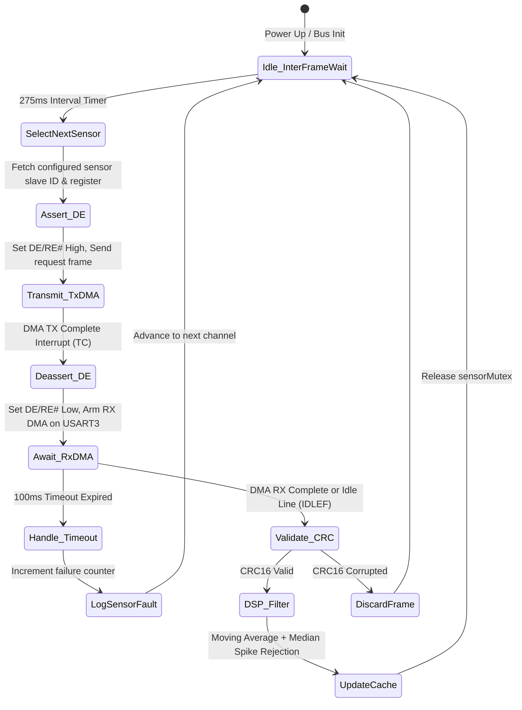
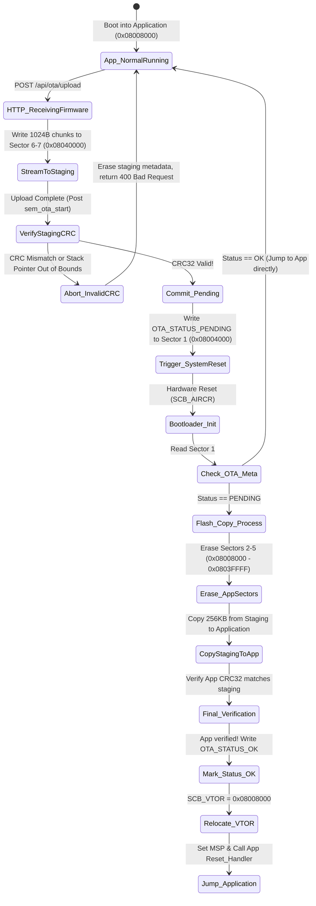
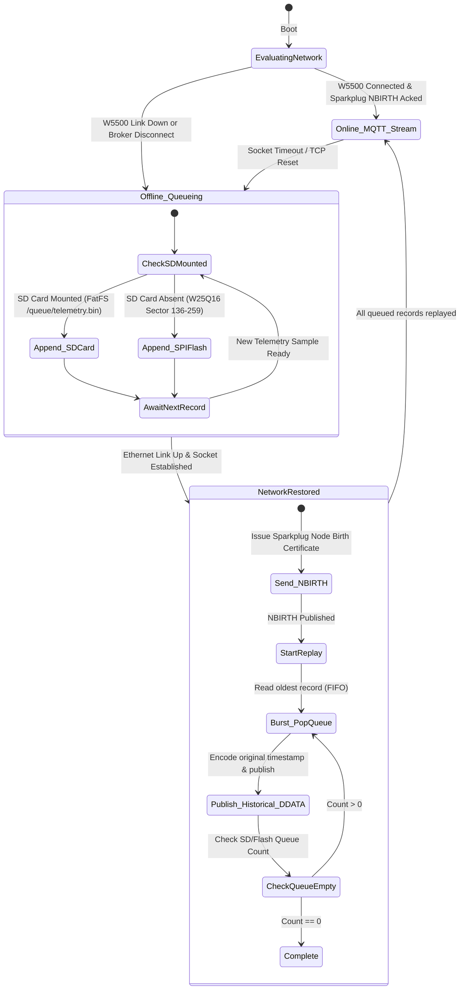

# Core System State Machines

## 1. Modbus RTU Polling & DMA Acquisition State Machine

---

## 2. Dual-Bank Staging OTA Bootloader State Machine

---

## 3. Store-and-Forward Offline Queue State Machine

