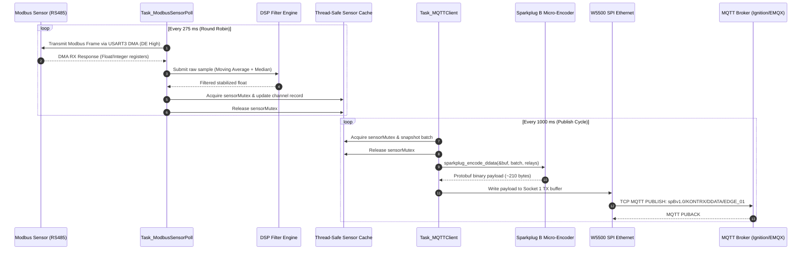
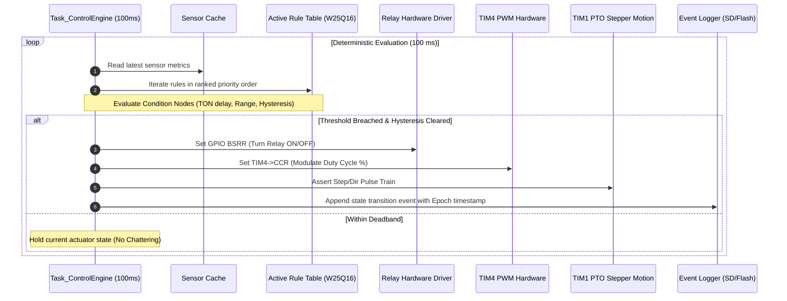
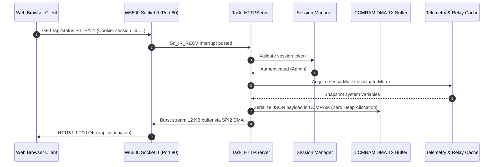

# System Communication Sequence Flows

## 1. End-to-End Telemetry Acquisition & Sparkplug B Publication Flow

---

## 2. Real-Time Automation Closed-Loop Control Sequence

---

## 3. Embedded Web Dashboard HTTP Request Lifecycle

