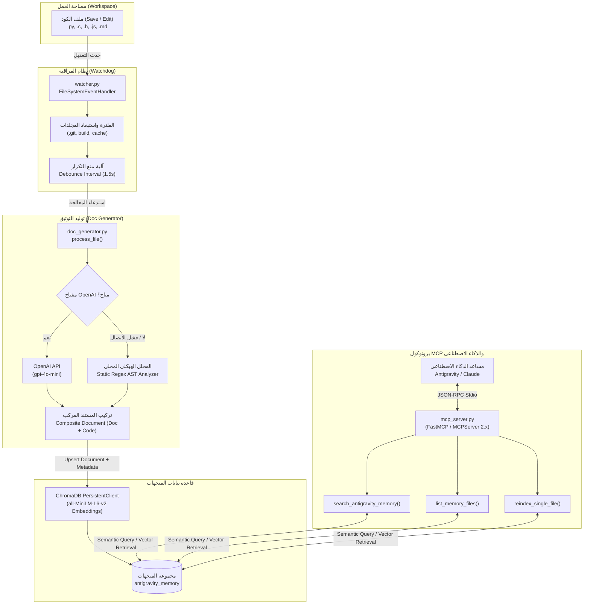

# 🧠 التوثيق الفني الشامل لنظام الذاكرة وقاعدة بيانات المتجهات ومخدم MCP
## Comprehensive Technical Documentation: Kontrx / Antigravity Memory System

---

## 📑 فهرس المحتويات (Table of Contents)
1. [نظرة عامة والهدف المعماري (Architecture Overview)](#1-نظرة-عامة-والهدف-المعماري)
2. [مخطط تدفق البيانات والتفاعل (System Workflow Diagram)](#2-مخطط-تدفق-البيانات-والتفاعل)
3. [المكون الأول: محرك قاعدة البيانات المتجهية `db.py`](#3-المكون-الأول-محرك-قاعدة-البيانات-المتجهية-dbpy)
4. [المكون الثاني: مولد التوثيق الذكي `doc_generator.py`](#4-المكون-الثاني-مولد-التوثيق-الذكي-doc_generatorpy)
5. [المكون الثالث: مراقب الملفات الحي `watcher.py`](#5-المكون-الثالث-مراقب-الملفات-الحي-watcherpy)
6. [المكون الرابع: خادم بروتوكول سياق النموذج `mcp_server.py`](#6-المكون-الرابع-خادم-بروتوكول-سياق-النموذج-mcp_serverpy)
7. [هيكل المتجهات والبيانات الوصفية (Vector & Metadata Schema)](#7-هيكل-المتجهات-والبيانات-الوصفية)
8. [آلية معالجة الأخطاء وحالات التراجع (Error Handling & Fallbacks)](#8-آلية-معالجة-الأخطاء-وحالات-التراجع)
9. [دليل التشغيل والاختبار والتكامل (Integration & Operations Guide)](#9-دليل-التشغيل-والاختبار-والتكامل)

---

## 1. نظرة عامة والهدف المعماري

تم تصميم وبناء **نظام الذاكرة (Memory System)** لمشروع **Kontrx / Antigravity** لحل التحديات التالية في بيئات تطوير الأنظمة المدمجة وإنترنت الأشياء:
- **فقدان السياق (Context Loss)**: النماذج اللغوية الكبيرة (LLMs) تمتلك نافذة سياق محدودة، بينما يحتوي المشروع على عشرات الملفات من طبقات مختلفة (HAL, MCAL, FreeRTOS, MQTT, Python).
- **التحديث الحي (Real-time Sync)**: عند قيام المطور بتعديل أو إضافة كود، يتم توليد التوثيق واستخراج الرموز وتحديث المتجهات تلقائياً دون أي تدخل يدوي.
- **الاسترجاع الدلالي (Semantic Retrieval)**: إتاحة البحث باللغة الطبيعية (عربي / إنجليزي) عن وظائف النظام (مثل: *"كيف أتحكم بالريليهات؟"* أو *"ما هي دوال الحساسات؟"*) واسترجاع التوثيق والكود بدقة عبر بروتوكول MCP القياسي.

---

## 2. مخطط تدفق البيانات والتفاعل



---

## 3. المكون الأول: محرك قاعدة البيانات المتجهية `db.py`

📁 **المسار:** [`memory_system/db.py`](file:///d:/WORKSPACE/IGNOVA/DEVELOPMENT/Kontrx/memory_system/db.py)

### المسؤولية الوظيفية
يوفر طبقة التجريد (Abstraction Layer) للتعامل مع قاعدة بيانات `ChromaDB` المحلية الدائمة (Embedded Vector DB).

### الدوال الأساسية:

#### 1. `get_chroma_client() -> chromadb.PersistentClient`
- ينشئ المجلد الدائم `memory_system/chroma_db` في حال عدم وجوده.
- يعيد كائن الاتصال الدائم بقاعدة البيانات دون الحاجة لتشغيل خادم خارجي منفصل.

#### 2. `get_memory_collection(client=None) -> chromadb.Collection`
- يسترجع أو ينشئ المجموعة المسماة `antigravity_memory`.
- يستخدم خوارزمية التضمين الافتراضية `all-MiniLM-L6-v2` لتوليد متجهات ذات 384 بعداً بدقة عالية وسرعة فائقة على المعالج المحلي.

#### 3. `upsert_document(doc_id: str, document: str, metadata: Dict[str, Any]) -> None`
- يقوم بإدخال أو تحديث مستند كودي وتوثيقي.
- **التنظيف التلقائي (Metadata Sanitization)**: يضمن تحويل كافة القيم في `metadata` إلى أنواع مدعومة في ChromaDB (`str`, `int`, `float`, `bool`) لتجنب أخطاء التسلسل.

#### 4. `query_documents(query_text: str, n_results: int = 5, where: Optional[Dict] = None) -> List[Dict]`
- يستقبل استعلام البحث باللغة الطبيعية.
- يقوم بحساب المسافة الدلالية (Cosine / L2 Distance) وإرجاع أفضل `n_results` مطابقة مع تفاصيل المسار والتوثيق والمسافة الدلالية.

#### 5. `list_all_documents(limit: int = 100) -> List[Dict]` & `delete_document(doc_id: str)`
- دوال إدارة وصيانة الفهرس لعرض الملفات المخزنة وحذف المستندات القديمة عند الحاجة.

---

## 4. المكون الثاني: مولد التوثيق الذكي `doc_generator.py`

📁 **المسار:** [`memory_system/doc_generator.py`](file:///d:/WORKSPACE/IGNOVA/DEVELOPMENT/Kontrx/memory_system/doc_generator.py)

### المسؤولية الوظيفية
قراءة محتوى ملفات الأكواد، تحليلها وتوليد توثيق عالي القيمة للمطورين والنماذج اللغوية، ثم حفظها مهيكلة في قاعدة البيانات المتجهية.

### الامتدادات المدعومة (`SUPPORTED_EXTENSIONS`):
| الامتداد | اللغة / النوع | الامتداد | اللغة / النوع |
| :--- | :--- | :--- | :--- |
| `.py` | Python | `.c`, `.h` | C Source / Header |
| `.cpp`, `.hpp` | C++ Source / Header | `.js`, `.ts` | JavaScript / TypeScript |
| `.json` | JSON Data | `.md` | Markdown Documentation |
| `.cmake` | CMake Build Rules | `.ld` | Linker Script |
| `.yaml`, `.yml` | YAML Config | `.txt` | Plain Text |

### منطق العمل التفصيلي:

1. **الفحص الأولي للسلامة والحجم (`process_file`)**:
   - التحقق من وجود الملف وامتداده.
   - التحقق من حجم الملف (`MAX_FILE_SIZE = 250 KB`) لتجنب إرهاق الذاكرة أو الملفات الثنائية الكبيرة.
   - القراءة بترميز `utf-8` مع معالجة الأخطاء (`errors="replace"`).

2. **التوليد الذكي عبر الذكاء الاصطناعي (`generate_ai_documentation`)**:
   - إرسال الكود مع Prompt تخصصي للنموذج `gpt-4o-mini` (أو النموذج المحدد في `.env`).
   - يتضمن الـ Prompt استخراج:
     1. الدور المعماري للملف (Module Purpose & Role).
     2. الدوال والواجهات والهياكل الأساسية (Key APIs & Structs).
     3. التفاعلات العتادية والبروتوكولية (FreeRTOS, HAL, MQTT, STM32).
     4. القيود والملاحظات التقنية (Constraints & Threading).

3. **المحلل الهيكلي الاحتياطي المحلي (`fallback_document_generator`)**:
   - يعمل فورياً في حال عدم توفر اتصال بالإنترنت أو عدم تعيين `OPENAI_API_KEY`.
   - يحلل الكود محلياً ويستخرج تعريفات الدوال (`def`, `class`, دوال C/C++ والأنماط الهيكلية) وعدد الأسطر ومعاينة الكود بدون أي تكلفة أو اعتمادية خارجية.

4. **تركيب المستند المركب (Composite Document Schema)**:
   - يتم دمج التوثيق المولد مع الكود الفعلي في مستند واحد لضمان أن البحث الدلالي يطابق كلاً من **الوصف النظري** و **الرموز البرمجية الفعلية**.

---

## 5. المكون الثالث: مراقب الملفات الحي `watcher.py`

📁 **المسار:** [`memory_system/watcher.py`](file:///d:/WORKSPACE/IGNOVA/DEVELOPMENT/Kontrx/memory_system/watcher.py)

### المسؤولية الوظيفية
مراقبة مساحة عمل المشروع في الوقت الفعلي والاستجابة لأحداث الحفظ (`on_modified`) والإنشاء (`on_created`) لإبقاء قاعدة بيانات الذاكرة متطابقة تماماً مع الكود الحي.

### المميزات التقنية:

1. **تصفية المسارات المستبعدة (`IGNORED_DIRS`)**:
   - يتم تلقائياً استبعاد المجلدات المؤقتة والضخمة وغير المصدرية لمنع استهلاك الموارد:
     `{".git", "build", "node_modules", "__pycache__", "chroma_db", ".gemini", "brain", "scratch", "ultrasonic_build", ".vscode", ".idea"}`

2. **منع التكرار (Debouncing Engine)**:
   - أغلب المحررات (مثل VS Code أو Antigravity) تقوم بعدة عمليات كتابة وتدقيق متتالية عند حفظ ملف واحد.
   - يقوم المراقب بتطبيق نافذة زمنية `debounce_interval = 1.5s` لمنع تكرار توليد التوثيق للملف نفسه في أجزاء من الثانية.

3. **معالجة فورية غير حاجزة (Flushed Output)**:
   - استخدام `print = functools.partial(print, flush=True)` لضمان ظهور سجلات المراقبة فورياً في الـ Terminal وبيئة Antigravity.

---

## 6. المكون الرابع: خادم بروتوكول سياق النموذج `mcp_server.py`

📁 **المسار:** [`memory_system/mcp_server.py`](file:///d:/WORKSPACE/IGNOVA/DEVELOPMENT/Kontrx/memory_system/mcp_server.py)

### المسؤولية الوظيفية
توفير واجهة تواصل موحدة ومتوافقة مع معيار **Model Context Protocol (MCP)** لتمكين نماذج الذكاء الاصطناعي من استدعاء أدوات الذاكرة عبر قنوات الإدخال/الإخراج القياسية (Stdio Transport).

### التوافقية الثنائية (Dual Version Compatibility):
تمت كتابة الخادم ليعمل بسلاسة مع:
- **`mcp >= 2.0`**: باستخدام فئة `MCPServer` الجديدة.
- **`mcp < 2.0`**: مع التراجع التلقائي لـ `FastMCP`.

### الأدوات المعرفة للذكاء الاصطناعي (MCP Tools):

```python
# 1. أداة البحث الدلالي الرئيسية
@mcp_app.tool()
def search_antigravity_memory(query: str, top_k: int = 4) -> str:
    """البحث الدلالي باللغة الطبيعية في قاعدة بيانات الذاكرة واسترجاع التوثيق والكود المرتبط."""

# 2. أداة استعراض الملفات المفهرسة
@mcp_app.tool()
def list_memory_files() -> str:
    """استعراض قائمة الملفات المخزنة في الذاكرة مع اللغات وتواريخ التحديث."""

# 3. أداة إعادة الفهرسة المباشرة
@mcp_app.tool()
def reindex_single_file(file_path: str) -> str:
    """إعادة تحليل وفهرسة ملف محدد وتحديث المتجهات يدوياً."""
```

---

## 7. هيكل المتجهات والبيانات الوصفية (Vector & Metadata Schema)

### تخطيط المستند المخزن في ChromaDB:
```json
{
  "id": "D:/WORKSPACE/IGNOVA/DEVELOPMENT/Kontrx/control_relays.py",
  "document": "# DOCUMENTATION FOR control_relays.py\n...\n---\n# CODE CONTENT:\n...",
  "metadata": {
    "file_name": "control_relays.py",
    "file_path": "D:/WORKSPACE/IGNOVA/DEVELOPMENT/Kontrx/control_relays.py",
    "language": "python",
    "file_size": 4101,
    "timestamp": 1726924452.12,
    "updated_at": "2026-09-21 16:14:12"
  }
}
```

---

## 8. آلية معالجة الأخطاء وحالات التراجع (Error Handling & Fallbacks)

| الحالة المحتملة | آلية المعالجة المتبعة | النتيجة |
| :--- | :--- | :--- |
| عدم توفر مفتاح `OPENAI_API_KEY` | التراجع التلقائي إلى `fallback_document_generator` | استخراج الدوال والواجهات محلياً بدون أخطاء. |
| انقطاع الإنترنت أثناء استدعاء API | التقاط الاستثناء والتراجع إلى التحليل الهيكلي المحلي | عدم توقف عملية الحفظ أو المراقب. |
| ترميزات غير مدعومة في ملفات الكود | قراءة الملف بترميز `utf-8` مع `errors="replace"` | عدم انهيار السكربت واستبدال المحارف المعطوبة بأمان. |
| بيئات طرفية لا تدعم محارف Unicode (مثل CP1252) | تحويل كافة الرموز والطباعة إلى نمط ASCII وتهيئتها بـ UTF-8 | استقرار تشغيل الخادم على Windows وLinux. |
| حفظ متكرر وسريع للملفات | تطبيق خوارزمية Debouncing بفاصل 1.5 ثانية | منع استهلاك الـ Tokens ومنع الحمل الزائد على القرص. |

---

## 9. دليل التشغيل والاختبار والتكامل

### أ) تشغيل المراقبة الحية في الطرفية (Terminal):
```powershell
python memory_system/watcher.py
```

### ب) إجراء فحص واختبار كامل للأدوات:
```powershell
python memory_system/test_mcp_client.py
```

### ج) ملف إعدادات الربط المعتمد (`C:\Users\IGNOVA\.gemini\config\mcp_config.json`):
```json
{
  "mcpServers": {
    "kontrx-memory": {
      "command": "C:\\Users\\IGNOVA\\AppData\\Local\\Programs\\Python\\Python310\\python.exe",
      "args": [
        "d:\\WORKSPACE\\IGNOVA\\DEVELOPMENT\\Kontrx\\memory_system\\mcp_server.py"
      ],
      "env": {
        "PYTHONIOENCODING": "utf-8"
      }
    }
  }
}
```
